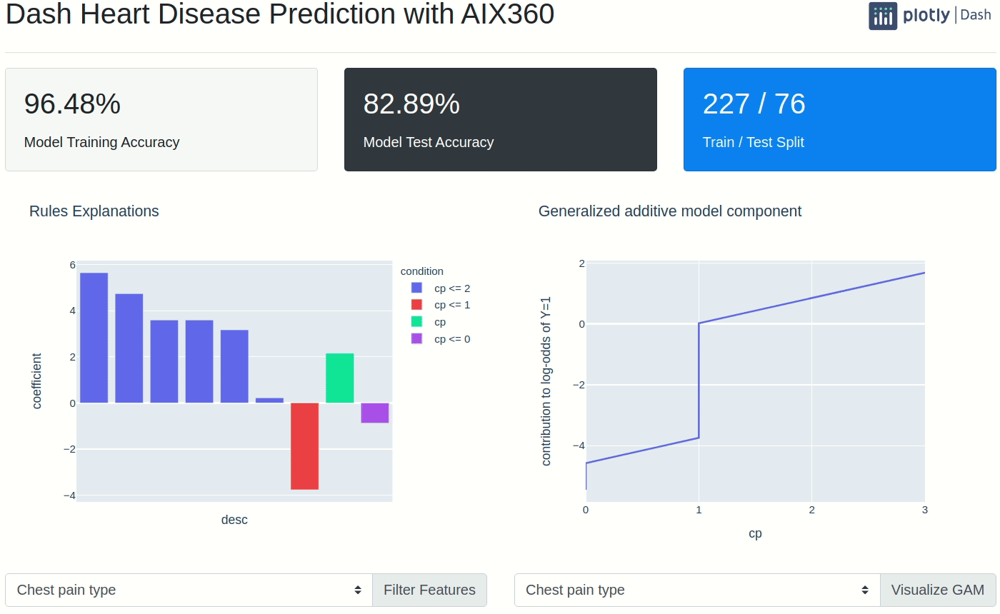

<!--
To get started, replace
Dash Heart Disease Prediction with AIX360 with your app name (e.g. Dash Super Cool App)
dash-aix360-heart with the short handle (e.g. dash-super-cool)

If this is in dash sample apps, uncomment the second "git clone https..." and remove the first one.
If this is in dash sample apps and you have a colab demo, uncomment the "Open in Colab" link to see the badge (make sure to create a ColabDemo.ipynb) first.

-->
# Dash Heart Disease Prediction with AIX360
<!-- 
[](https://colab.research.google.com/github/plotly/dash-sample-apps/blob/master/apps/dash-aix360-heart/ColabDemo.ipynb)
 -->

This app shows you how to visualize and analyze explainable AI (xAI) models with [Dash](https://plotly.com/dash/) and [IBM's AI Explainability 360 (AIX360)](https://aix360.mybluemix.net/). It uses a [LogisticRuleRegression](https://aix360.readthedocs.io/en/latest/dise.html#aix360.algorithms.rbm.logistic_regression.LogisticRuleRegression) model trained on the [UCI Heart Disease data set](https://archive.ics.uci.edu/ml/datasets/heart+Disease) for predicting the presence of heart disease in Cleveland patients.



The model we showcase is not only accurate, but it also lets you compute the [coefficient of each rule](https://aix360.readthedocs.io/en/latest/dise.html#aix360.algorithms.rbm.logistic_regression.LogisticRuleRegression.explain), which is the combination of various conditions of the patient. Furthermore, you can also [visualize](https://aix360.readthedocs.io/en/latest/dise.html#aix360.algorithms.rbm.logistic_regression.LogisticRuleRegression.visualize) the generalized additive model component of each patient attribute. According to the docs, the latter *" includes first-degree rules and linear functions of unbinarized ordinal features but excludes higher-degree rules."*


## Instructions

To get started, first clone this repo:

<!-- ```
git clone https://github.com/plotly/dash-aix360-heart.git
cd dash-aix360-heart
``` -->


```
git clone https://github.com/plotly/dash-sample-apps.git
cd dash-sample-apps/apps/dash-aix360-heart
```


Create and activate a conda env:
```
conda create -n dash-aix360-heart python=3.7.6
conda activate dash-aix360-heart
```

Or a venv (make sure your `python3` is 3.6+):
```
python3 -m venv venv
source venv/bin/activate  # for Windows, use venv\Scripts\activate.bat
```

Install all the requirements:

```
pip install -r requirements.txt
```

You can now run the app:
```
python app.py
```

and visit http://127.0.0.1:8050/.


### Windows virtualenv

If you are on Windows, and you cannot use Windows Subsystem for Linux (WSL)

