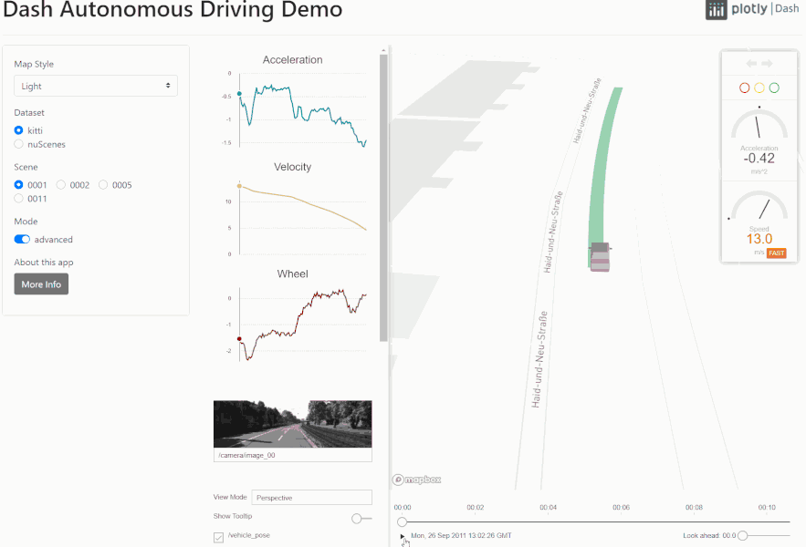

## Dash Autonomous Visualization System

This is the explorer app accompanying the [Dash AVS UI](https://github.com/plotly/dash-avs-ui). This app loads scenes collected from self-driving car trips, and displays both sensor (e.g. lidar, path) and human annotated data (bounding boxes). You can choose between a basic and an advanced one UI.


💻 [Demo](https://dash-gallery.plotly.host/dash-avs-explorer/)

📰 [Article](https://medium.com/plotly/the-history-of-autonomous-vehicle-datasets-and-3-open-source-python-apps-for-visualizing-them-afee9d13f58a)



## Instructions

To get started, first clone this repo:


```
git clone https://github.com/plotly/dash-sample-apps.git
cd dash-sample-apps/apps/dash-avs-explorer
```


Create and activate a conda env:
```
conda create -n dash-avs-explorer python=3.7.6
conda activate dash-avs-explorer
```

Or a venv (make sure your `python3` is 3.6+):
```
python3 -m venv venv
source venv/bin/activate  # for Windows, use venv\Scripts\activate.bat
```

Install all the requirements:

```
pip install -r requirements.txt
```

You can now run the app:
```
python app.py
```

and visit http://127.0.0.1:8050/.


Please add `MAPBOX_ACCESS_TOKEN` as an environment variable to the app manager.
