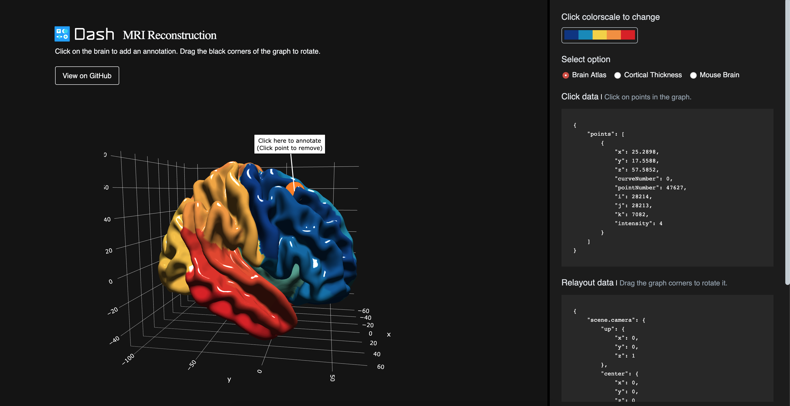

# Dash Brain Viewer

## About this app


This demo represents a brain model. The user is able to annotate the brain.


Original repo: [plotly/dash-brain-surface-viewer](https://github.com/plotly/dash-brain-surface-viewer)


## How to run this app

(The following instructions apply to Posix/bash. Windows users should check
[here](https://docs.python.org/3/library/venv.html).)

First, clone this repository and open a terminal inside the root folder.

Create and activate a new virtual environment (recommended) by running
the following:

```bash
python3 -m venv myvenv
source myvenv/bin/activate
```

Install the requirements:

```bash
pip install -r requirements.txt
```
Run the app:

```bash
python app.py
```
Open a browser at http://127.0.0.1:8050

## Screenshots



### Credit

- [ACE Lab](https://www.mcgill.ca/bic/research/ace-lab-evans) at McGill for the brain data and inspiration from their excellent brain [Surface Viewer](https://brainbrowser.cbrain.mcgill.ca/surface-viewer#ct)
- [Julia Huntenburg](https://github.com/juhuntenburg) for figuring out how to [read MNI objects in Python](https://github.com/juhuntenburg/laminar_python/blob/master/io_mesh.py)
- [E. Petrisor](https://github.com/empet) for her extensive [exploration in Python with Plotly.js meshes](https://plot.ly/~empet/14767/mesh3d-from-a-stl-file/)

