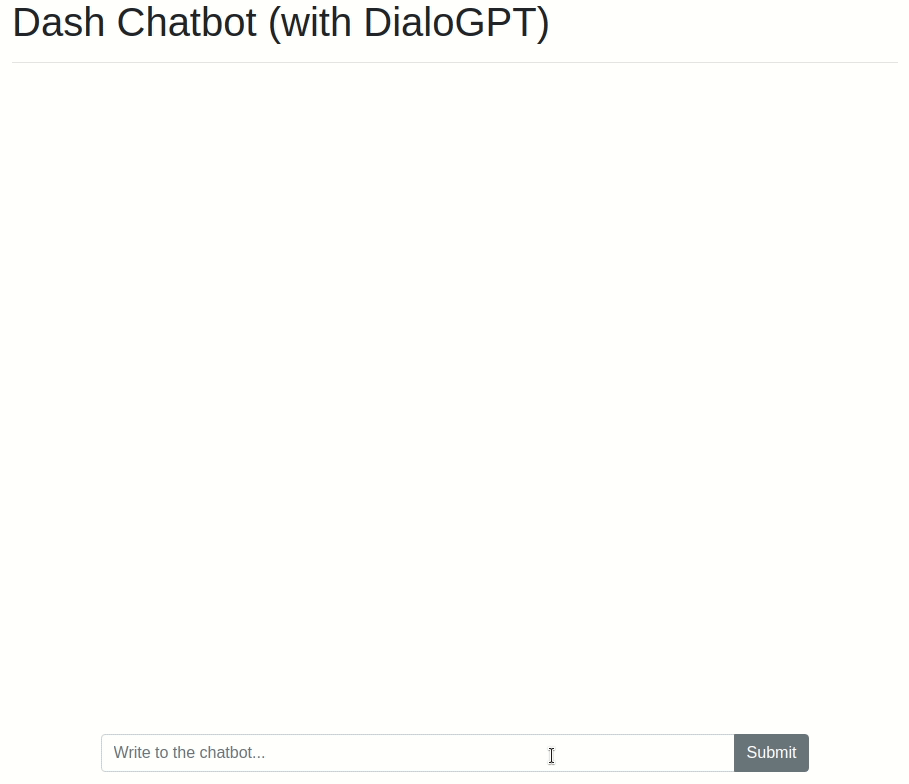

# Dash Summarization
[](https://colab.research.google.com/github/plotly/dash-sample-apps/blob/master/apps/dash-chatbot/ColabDemo.ipynb)

This app lets you chat with [DialoGPT](https://huggingface.co/transformers/model_doc/dialogpt.html), a chatbot based on GPT that was trained on 147M comments+replies from Reddit. The model was developed by [Microsoft Research](https://github.com/microsoft/DialoGPT), and it is hosted on [Huggingface's model repository](https://huggingface.co/microsoft/DialoGPT-large).



## Instructions

To get started, first clone this repo:
```
git clone https://github.com/plotly/dash-sample-apps.git
cd dash-sample-apps/apps/dash-chatbot
```

Create a conda env (or venv) and install the requirements:
```
conda create -n dash-chatbot python=3.7.6
conda activate dash-chatbot
pip install -r requirements.txt
```

You can now run the app:
```
python app.py
```

and visit http://127.0.0.1:8050/.
