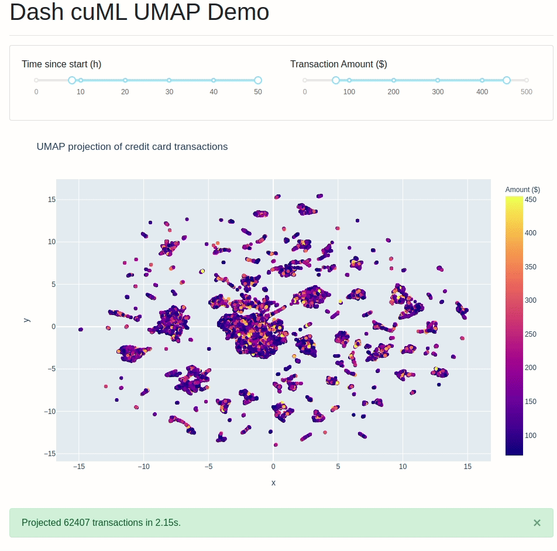

# Dash cuML UMAP
[](https://colab.research.google.com/github/plotly/dash-sample-apps/blob/master/apps/dash-cuml-umap/ColabDemo.ipynb)

A demo of RAPIDS.ai's cuML UMAP functionality.



## Instructions

### Clone Repo and create environment
To get started, first clone this repo:
```
git clone https://github.com/plotly/dash-sample-apps.git
cd dash-sample-apps/apps/dash-cuml-umap
```

Create a conda env and install the requirements:
```
conda create --name dash-cuml-umap --file requirements.txt
```


### Download the dataset

In order to download the dataset, please create an account on kaggle.com, and download it [from this dataset](https://www.kaggle.com/mlg-ulb/creditcardfraud). Make sure to place `creditcard.csv` inside `dash-sample-apps/apps/dash-cuml-umap`.

### Run the app

You can now run the app:
```
python app.py
```

and visit http://127.0.0.1:8050/.

## Note about exporting

Since RAPIDS.ai only support a conda environment, `pip freeze` the requirements would not work. Instead, do:
```
conda list -e > requirements.txt
```
