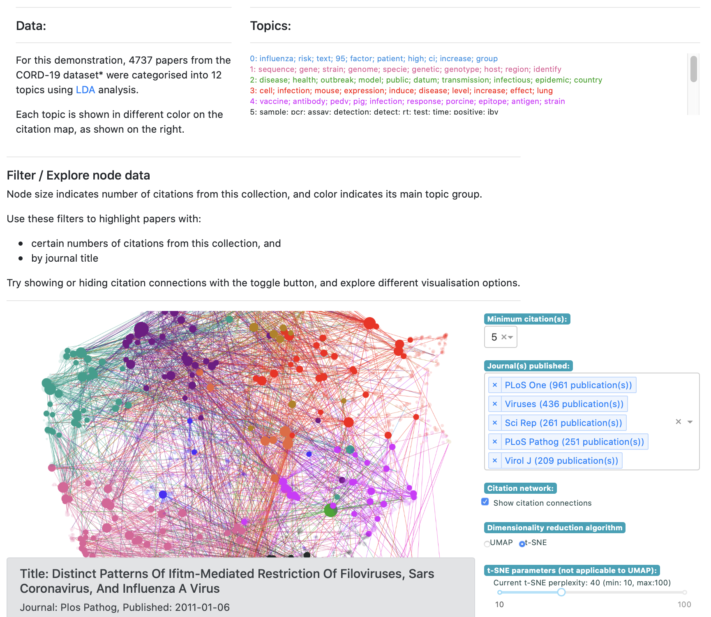

# Dash-cytoscape NLP demo for Plotly

This demo app is built using plotly-dash and dash-cytoscape, as an 
example of a network diagram that may be displayed.

The dataset used it the 'Commercial use subset' of the CORD-19 dataset from 
[Semantic Scholar](https://pages.semanticscholar.org/coronavirus-research), 
downloaded on 2/Apr/2020. 

Simply run `python app.py` to see the network visualisation as below.



The scripts used to produce the data are labelled by number:

    1_lda_analysis.py
    2_add_biblio_data.py
    3_reduce_num_nodes.py


Simply downloading the dataset (including metadata.csv) 
and running these scripts should reproduce the same outputs.

#### PERFORMANCE TWEAKS 

You can edit `4_build_default_cytomap.py` to change these parameters,
```
min_n_cites = 1
top_journals = list(journal_ser.index)[:3]
```
and run the file to adjust default node layouts and ranges.

You may also edit the drop-down menu range 
```
id="n_cites_dropdown",
options=[
    {"label": k, "value": k} for k in range(1, 21)
],
```
in `app.py` to adjust the selectable range of filters being displayed.

* Created by JP Hwang for Plotly 

