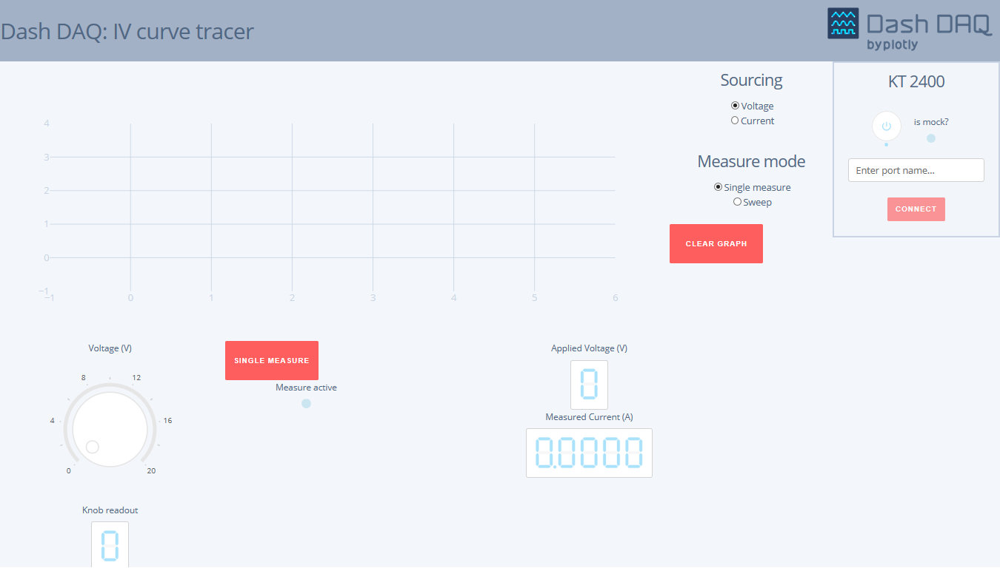

# dash-daq-iv-tracer

## Introduction
`dash-daq-iv-tracer` is a repository created to acquire current-voltage I-V curves with a Keithley 2400 SourceMeter.

[Demo app on DDS](https://dash-gallery.plotly.host/dash-daq-iv-tracer), and dashdaq.io [blog post](https://www.dashdaq.io/build-an-i-v-curve-tracer-with-a-keithley-2400-sourcemeter-in-python)


### [Technique/field associated with the instrument]
I-V curve is a good way to characterize electronic components (diode, transistor or solar cells) and extract their operating properties. It is widely used in electrical engineering and physics. 

### dash-daq
[Dash DAQ](http://dash-daq.netlify.com/#about) is a data acquisition and control package built on top of Plotly's [Dash](https://plot.ly/products/dash/).


## Requirements
It is advisable	to create a separate virtual environment running Python 3 for the app and install all of the required packages there. To do so, run (any version of Python 3 will work):

```
python3 -m virtualenv [your environment name]
```
```
source activate [your environment name]
```

To install all of the required packages to this environment, simply run:

```
pip install -r requirements.txt
```

and all of the required `pip` packages, will be installed, and the app will be able to run.


## How to use the app



To control your SourceMeter, you need to set the `mock` attribute to `False` in the `app.py` file

```
iv_generator = keithley_instruments.KT2400(mock_mode=False)
```

You can then run the app :

```
$ python app.py
```

If you already know the COM/GPIB port number, you can feed it to the SourceMeter class

```
iv_generator = keithley_instruments.KT2400(
  mock_mode=False,
  instr_port_name=[your instrument's COM/GPIB port]
)
```

Or you can enter it from the app display in your browser and click the button labelled 'Connect'

If you don't have the instrument connected to your computer but would still like to test the app you can run

```
$ python app_mock.py
```

You can also set the `mock` attribute to `True` in the `app.py` file.


There is help about several of the app's components when you hover the mouse over them. A text Markdown on the app [demo](https://dash-gallery.plotly.host/dash-daq-iv-tracer) provides you with a 
simple "how to" guide. For more detailed explanations please refer to the [blogpost](https://www.dashdaq.io/build-an-i-v-curve-tracer-with-a-keithley-2400-sourcemeter-in-python)


## Resources

Manual of the Keithley [2400](http://research.physics.illinois.edu/bezryadin/labprotocol/Keithley2400Manual.pdf)
