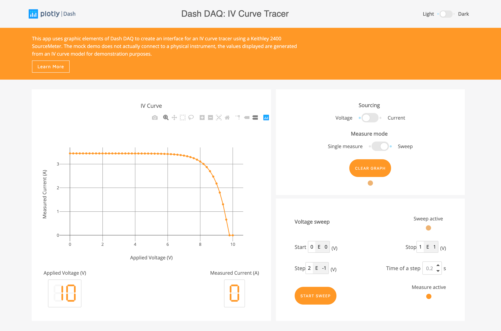
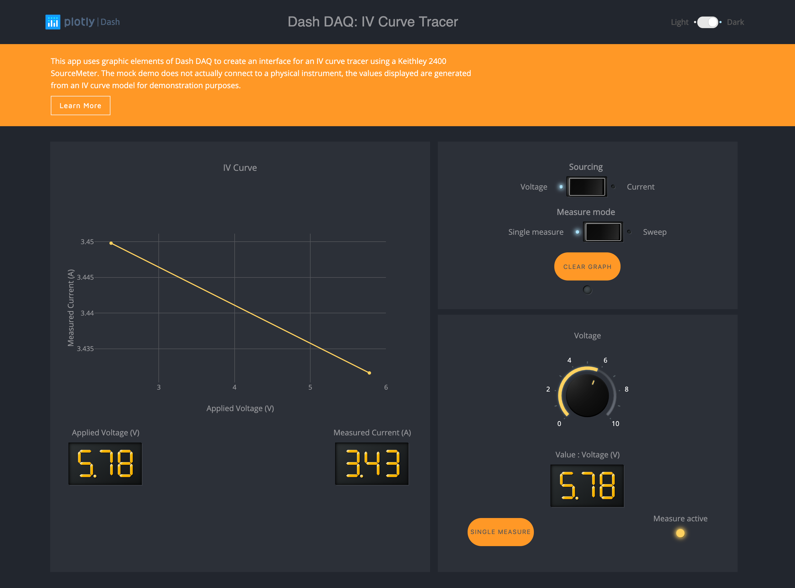
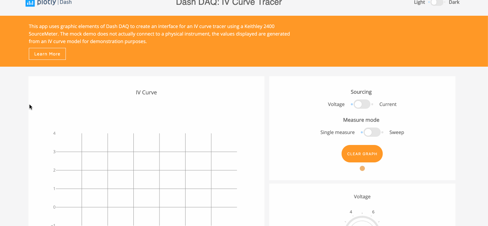

# Dash DAQ IV Curve Tracer

Dash abstracts away all of the technologies and protocols required to build an interactive web-based application, and
is a simple and effective way to bind a user interface around your Python code. To learn more about Dash, check out our
[documentation](https://dash.plot.ly/).

## About the app

`dash-daq-iv-tracer` uses the graphic elements of Dash DAQ to create an interface for acquiring current-voltage I-V curves with a Keithley 2400 SourceMeter.
[Try this demo app](https://github.com/plotly/dash-sample-apps/tree/master/apps/dash-daq-iv-tracer) on the Dash Deployment Server], and read more about the code in [our blog post](https://www.dashdaq.io/build-an-i-v-curve-tracer-with-a-keithley-2400-sourcemeter-in-python).

### IV Curves

I-V curve is a good way to characterize electronic components (diode, transistor or solar cells) and extract their operating properties. It is widely used in electrical engineering and physics.
The Keithley 2400 SourceMeter provides precision voltage and current sourcing as well as measurement.

### dash-daq

[Dash-DAQ](http://dash-daq.netlify.com/#about) is a data acquisition and control package built on top of Plotly's
[Dash](https://plot.ly/products/dash/). It comprises a robust set of controls that make it simpler to integrate data
acquisition and controls into your Dash applications.

## Getting Started

### Controls

- Single measurement mode: Adjust the value of the source with the knob at the bottom of the graph area and click on the `SINGLE MEASURE` button, the measured value will be displayed. Repetition of this procedure for different source values will reveal the full IV curve.

- Sweep mode: Set the sweep parameters `start`, `stop` and `step` as well as the timevspent on each step, then click on the button `START SWEEP`, the result of the sweep will be displayed on the graph. The data is never erased unless the button `CLEAR GRAPH` is pressed, or if the source type is changed.

- Dark/light theme: Click on theme toggle on top of the page to view dark/light layout.

### Running the app locally

First create a virtual environment with conda or venv inside a temp folder, then activate it.

```
virtualenv venv

# Windows
venv\Scripts\activate
# Or Linux
source venv/bin/activate

```

Clone the git repo, then install the requirements with pip

```

git clone https://github.com/plotly/dash-sample-apps
cd dash-sample-apps/apps/dash-daq-iv-tracer
pip install -r requirements.txt

```

Run the app

```

python demo.py

```

## Screenshots






