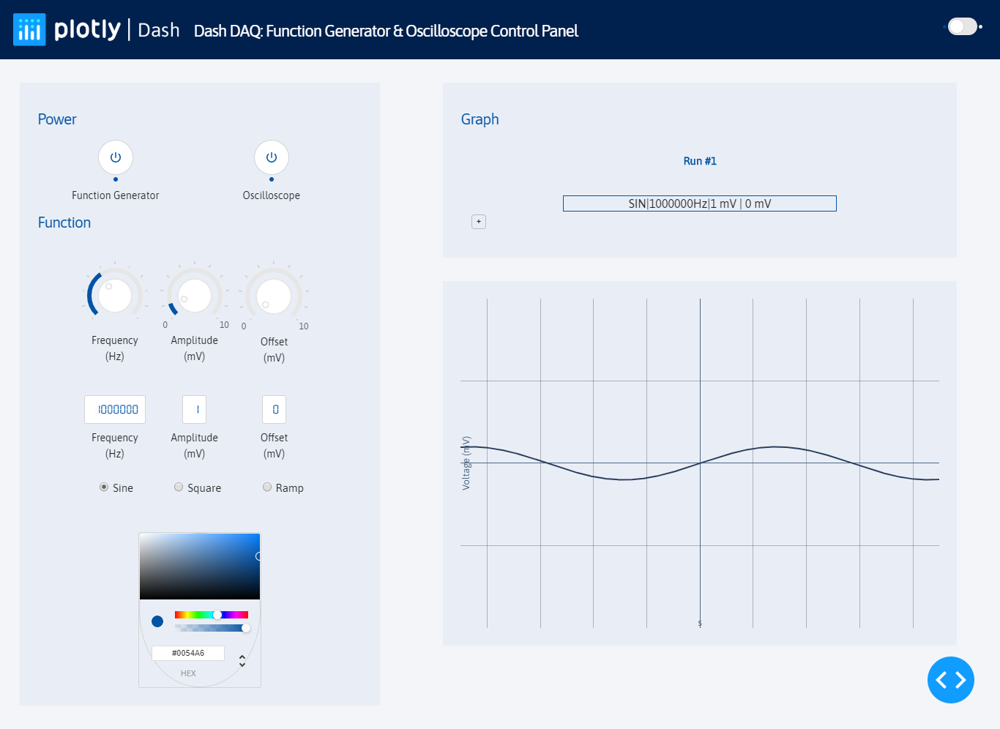

# Dash-Tektronix-350(Function Generator/Oscilloscope)

## About this app

A mock app of the Tektronix TDS 350 Oscilloscope. View a demo and learn more about this application from our blog entry [here](https://www.dashdaq.io/tektronix-function-generator) and [here](https://www.dashdaq.io/oscilloscope-logging).

Dash abstracts technologies and protocols required to build an interactive web-based application and is a simple and effective way to bind a user interface around your Python code. To learn more check out our [documentation](https://dash.plot.ly/).

## How to run this app

To run this app first clone repository and then open a terminal to the app folder.

```
git clone https://github.com/plotly/dash-sample-apps.git
cd dash-sample-apps/apps/dash-daq-tektronix350
```

Create and activate a new virtual environment (recommended) by running
the following:

On Windows

```
virtualenv venv 
\venv\scripts\activate
```

Or if using linux

```bash
python3 -m venv myvenv
source myvenv/bin/activate
```

Install the requirements:

```
pip install -r requirements.txt
```
Run the app:

```
python app_mock.py
```
You can run the app on your browser at http://127.0.0.1:8050


## Screenshots



## Resources

To learn more about Dash, please visit [documentation](https://plot.ly/dash).
To learn more about Dash DAQ, visit [Dash DAQ Documentation](https://dash.plot.ly/dash-daq).

