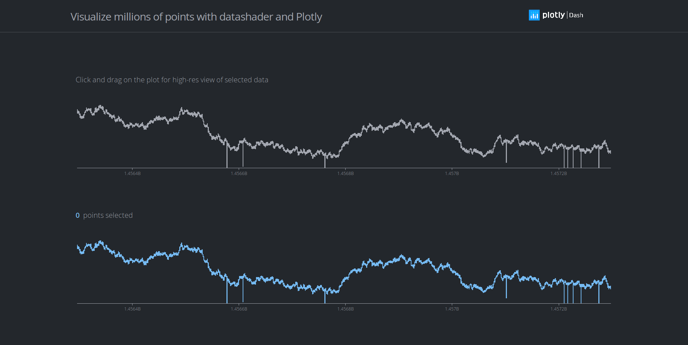

### Dash Datashader

This is a demo of the [Dash](https://plot.ly/products/dash/) interactive Python framework developed by [Plotly](https://plot.ly/).
Dash abstracts away all of the technologies and protocols required to build an interactive web-based application and is a simple and effective way to bind a user interface around your Python code.

Try out the [demo app here](https://dash-gallery.plotly.host/dash-datashader/).



=======

## Requirements
We suggest you to create a separate virtual environment running Python 3 for this app, and install all of the required dependencies there. Run in Terminal/Command Prompt:

```
git clone https://github.com/plotly/dash-sample-apps
cd dash-sample-apps/apps/dash-datashader
python3 -m virtualenv venv
```
In UNIX system: 

```
source venv/bin/activate
```
In Windows: 

```
venv\Scripts\activate
```

To install all of the required packages to this environment, simply run:

```
pip install -r requirements.txt
```

and all of the required `pip` packages, will be installed, and the app will be able to run.

## How to use the app
Run this app locally by:
```
python app.py
```
Open http://127.0.0.1:8050/ in your browser.

Drag a section of the top graph in order to display the zoomed in graph on the bottom.

