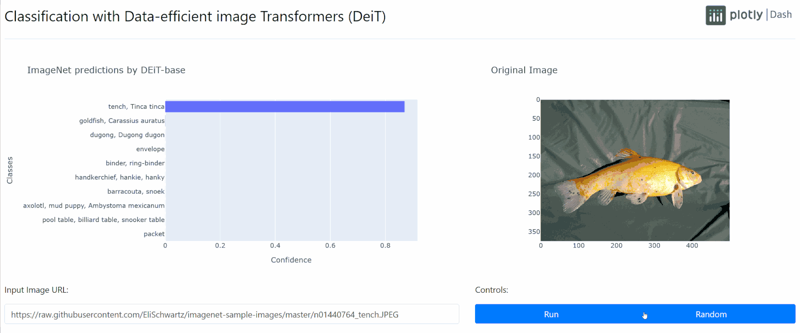

<!--
To get started, replace
Classification with Data-efficient image Transformers (DeiT) with your app name (e.g. Dash Super Cool App)
dash-deit with the short handle (e.g. dash-super-cool)

If this is in dash sample apps, uncomment the second "git clone https..." and remove the first one.
If this is in dash sample apps and you have a colab demo, uncomment the "Open in Colab" link to see the badge (make sure to create a ColabDemo.ipynb) first.

-->
# Classification with Data-efficient image Transformers (DeiT)
<!-- 
[](https://colab.research.google.com/github/plotly/dash-sample-apps/blob/master/apps/dash-deit/ColabDemo.ipynb)
 -->

*A User Interface for DeiT built with Dash in ~130 lines of pure Python. [Click here](https://dash-gallery.plotly.host/dash-deit/) for a demo.*

[Data-efficient image Transformers (DeiT)](https://ai.facebook.com/blog/data-efficient-image-transformers-a-promising-new-technique-for-image-classification/) is a new family of computer vision models that achieve near state-of-the-art performance on ImageNet with significantly less training data and computation resources. The smaller variant can process up to 500 images per second with very high accuracy, and the largest variant matches the performance of EfficientNet-B7 on ImageNet while being 2x faster to train.



## Overview

- The code is open-source and ready to be forked.
- Everything is in pure Python - not a single line of JavaScript required.
- The entire app was written in ~130 lines of Python, including downloading the images, torch transformations, running the model, and formatting the ImageNet labels.
- From development to production in minutes with [Dash Kubernetes](https://plotly.com/dash/kubernetes/) - no need to spend hours figuring out deployment.
- The application was based on [Dash DETR](https://github.com/plotly/dash-detr)


## Instructions

To get started, first clone this repo:

```
git clone https://github.com/plotly/dash-sample-apps.git
cd dash-sample-apps/apps/dash-deit
```


Create and activate a conda env:
```
conda create -n dash-deit python=3.7.6
conda activate dash-deit
```

Or a venv (make sure your `python3` is 3.6+):
```
python3 -m venv venv
source venv/bin/activate  # for Windows, use venv\Scripts\activate.bat
```

Install all the requirements:

```
pip install -r requirements.txt
```

You can now run the app:
```
python app.py
```

and visit http://127.0.0.1:8050/.

## Contact

Interested in building or deploying apps like this? [Reach out](https://plotly.com/contact-us/) or [get a demo](https://plotly.com/get-demo).
