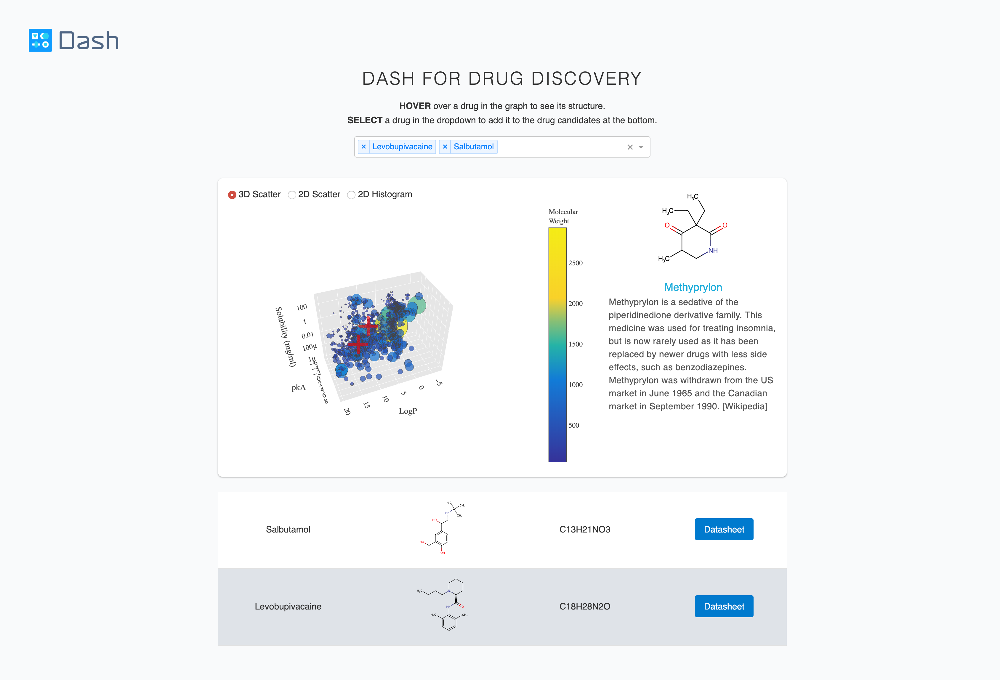

# Dash Drug Discovery

## About this app


This demo allows users to compare and explore different drug properties by selecting on the dropdown menu.


Original repo: [plotly/dash-drug-discovery-demo](https://github.com/plotly/dash-drug-discovery-demo)


## How to run this app

(The following instructions apply to Posix/bash. Windows users should check
[here](https://docs.python.org/3/library/venv.html).)

First, clone this repository and open a terminal inside the root folder.

Create and activate a new virtual environment (recommended) by running
the following:

```bash
python3 -m venv myvenv
source myvenv/bin/activate
```

Install the requirements:

```bash
pip install -r requirements.txt
```
Run the app:

```bash
python app.py
```
Open a browser at http://127.0.0.1:8050

## Screenshots



## Resources

- To learn more about Dash, check out our [documentation](https://plot.ly/dash).