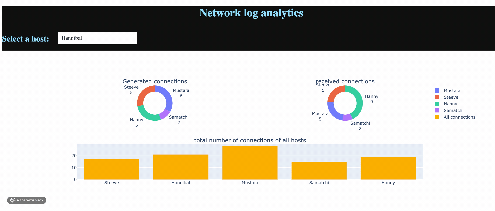

# What's inside?

*  A tool that genreate files continuously & simultanuously process them(starting each x time from the most recent file) and visualize the results (on terminal & dashboard)
    the generated log file contains newline-terminated, space-separated text formatted like:
    <unix_timestamp> <hostname> <hostname>
    For example:
    1366815793 Hannibal  Hanny
    Each line represents connection from a host (left) to another host (right) at a given time. The lines are roughly sorted by timestamp.

*   The processing  tool  parse previously written log files and terminate or collect input from a new log file while it's being written and run indefinitely.
The program outputs every x  amount of time:
    *  A list of hostnames connected to a given (configurable) host during the lest x time
    *  A list of hostnames received connections from a given (configurable) host during the last x time 
    *  The hostname(s) that generated most connections in the last x time

## Files
The repo contains:
*  Folders 
    *  data: contains the data source data for the first part and for the tests
    *  scripts: contains the log generation simulator and the log processing script
    *  aktools: The package containig the processing tools and conf file
    *  tests: containing simplistic tests
    *  output: contains the generated 
    
*  Files
   *   README.md
   *   requirement.txt
   *   setup.py
   *   LICENSE.md
   *   .gitignore


## Notes and asssumptions 

*   I assumed that a unique log file generation should not take more than some x time to generate.
*   Each predefined amount of time log files are processed
*   The logs are in each iteration reduced and sorted by time
*   The processing start with the file that is currently generated
*   The log file are parsed starting from the end (recent values first)
*   I assumed that when hosts have the same highest number of connection, all of them should be displayed
*   Insted of repeating the host's name multiple times (ex: A host receives multiples connections from another), I considered for the sake of visibility to use collection for occurences count.
*   I assumed that log files will be archived/flexibily stored so I didn't create a routine to delete them 
*   CPU optimization was considered sleeping by the process in each iteration
*   Memory optimization was considered by using built-in functions and my code syntax knowledge (less variables, comprehension lists...).


## Prerequisites

*   Python environment (version used: 3.8.3 )
*   See requirement.txt


## Demo 

*   Run the app.py

```
python app.py
```
*   Open the dashboard on http://127.0.0.1:8089/



## More usage
*   By default a list of 5 hosts, It can changed it the aktool/conf.py file. Don't forget to run the setup again to consider the changes, or restart the app since  'python setup.py install' is run each time the app starts

```
['Hannibal','Samatchi', 'Hanny', 'Steeve','Mustafa' ]
```


*   For the proof of concept you can start by generating logs with 6 lines.
```
python generate_log_files.py  6
```
*   After the log is created. the message 'log file <index> finished'
The output will look like
```
log file 1 finished
log file 2 finished
log file 3 finished
log file 4 finished
log file 5 finished
log file 6 finished
log file 7 finished
log file 8 finished
log file 9 finished
...
```

*   By default the log file out of order time is 9s. I considered it useful to include log files created slightly before init_datetime but still have entry lines in the interval. This time should be increased if the number of lines is increased.
It can be set in the aktool/conf.py file

*   Then we can proceed and run our processing script to output:
    *    Hosts that connected to  Hannibal in the last 10 s
    *    Hosts that received connection from Hannibal in the last 10 s
    *    the hostname that generated most connections in the last 10 s

By:

```
python scripts/txt_disp.py Hannibal 10
```
'Hannibal' being the hostname and 10 the number of seconds by which the process looks backward and also by which it repeats itself.
So each 10 s it will calculate again.

An output should normally look like:
```
It is :  13:31:58 12/14/20.  the next output is in 10 s. 

Hosts that connected to  Hannibal in the last 10 s are:  {'Hannibal': 1} 

Hosts that received connection from Hannibal in the last 10 s are:  {'Steeve': 3, 'Hanny': 1, 'Hannibal': 1} 

The hostname that generated most connections in the last 10 s is:  {'Hannibal': 5}
```

Or by graphic display:

```
python scripts/dashboard_disp.py 
```

## Running the tests

*   The test script is in the /tests folder and uses short and long log files to test the tools
To run the tests: 
```
python -m unittest tests/tests.py
```
*   If everything alright this message should appear:

```
.......
----------------------------------------------------------------------
Ran 7 tests in 0.045s

OK
```


## Authors

* **Anass Khaldi** 


## License

This project is licensed under the MIT License - see the [LICENSE.md](LICENSE.md) file for details

