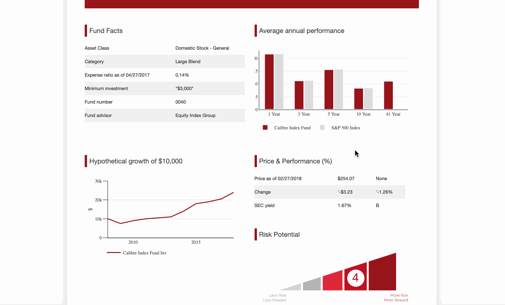
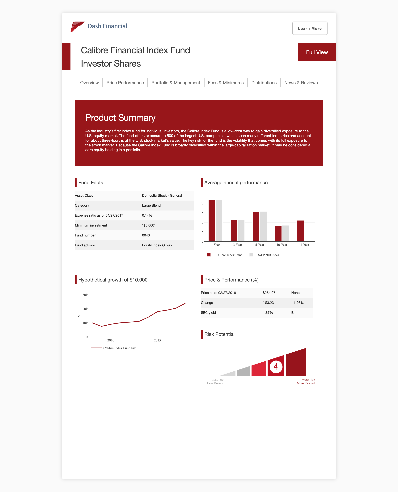
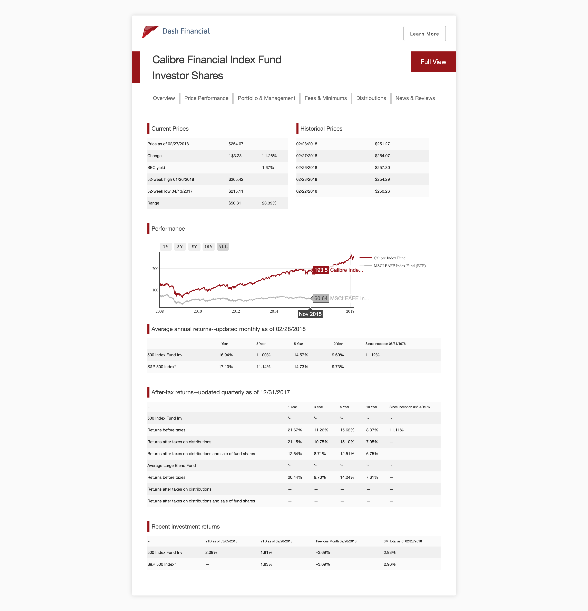

# Dash Financial Report

This is a demo of the [Dash](https://plot.ly/products/dash/) interactive Python framework developed by [Plotly](https://plot.ly/).

Dash abstracts away all of the technologies and protocols required to build an interactive web-based application and is a simple and effective way to bind a user interface around your Python code. To learn more about Dash, take a look at our [documentation](https://dash.plot.ly). If you're interested in deploying this application, check out [Dash Deployment Server](https://dash.plot.ly/dash-deployment-server/) - Plotly's commercial offering for hosting and sharing Dash Apps on-premise or in the cloud.

## Getting Started

### Running the app locally

First create a virtual environment with conda or venv inside a temp folder, then activate it.

```
virtualenv venv

# Windows
venv\Scripts\activate
# Or Linux
source venv/bin/activate

```

Clone the git repo, then install the requirements with pip

```

git clone https://github.com/plotly/dash-sample-apps
cd dash-sample-apps/apps/dash-financial-report
pip install -r requirements.txt

```

Run the app

```

python app.py

```

## About the app

This is an interactive, multi-page report which displays a variety of tables, bullet points, and Plotly interactive plots in a report format. The app incorporates custom local and external CSS to display distinct pages for PDF print.

## Built With

- [Dash](https://dash.plot.ly/) - Main server and interactive components
- [Plotly Python](https://plot.ly/python/) - Used to create the interactive plots

The following are screenshots for the app in this repo:







