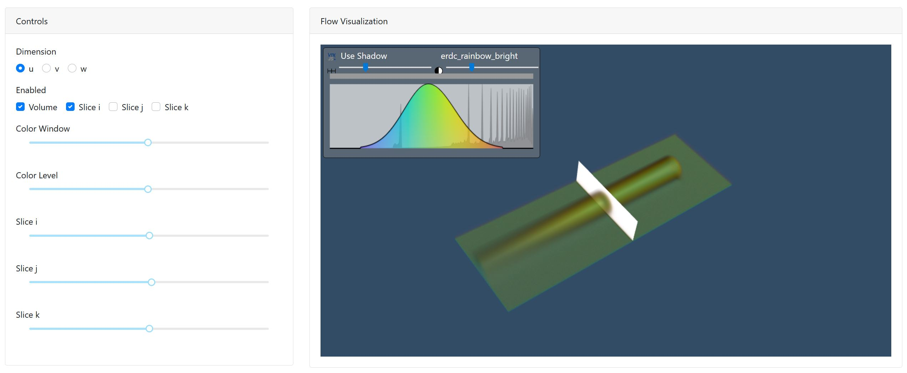

# Flow Visualization with FLORIS and VTK

* [Demo](https://dash-gallery.plotly.host/dash-floris-flow)
* [FLORIS Repo](https://github.com/NREL/floris)
* [Dash VTK](https://github.com/plotly/dash-vtk)



## Downloading and running a single app

Visit the [releases page](https://github.com/plotly/dash-sample-apps/releases) and download and `unzip` the app you want. Then `cd` into the app directory and install its dependencies in a virtual environment in the following way:

```bash
python -m venv venv
source venv/bin/activate  # Windows: \venv\scripts\activate
pip install -r requirements.txt
```

then run the app:
```bash
python app.py
```

## Contact

Interested in building or deploying apps like this? [Reach out](https://plotly.com/contact-us/) or [get a demo](https://plotly.com/get-demo).
