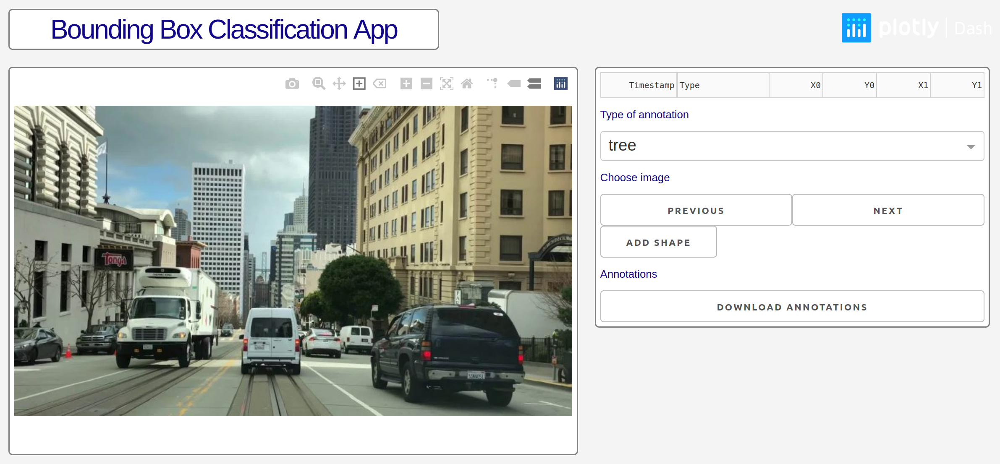

# Dash Bounding Box Image Annotation

## About this app

This shows how Dash can be used to make an application that collects annotations
of the content in parts of images. These bounding-box annotations could be
downloaded and used to train an image content classifier.

## How to run this app locally

(The following instructions are for unix-like shells)

Clone this repository and navigate to the directory containing this `README` in
a terminal.

Create and activate a virtual environment (recommended):

```bash
python3 -m venv myvenv
source myvenv/bin/activate
```

Install the requirements

```bash
pip install -r requirements.txt
```

Run the app. An IP address where you can view the app in your browser will be
displayed in the terminal.

```bash
python app.py
```

## Screenshot



