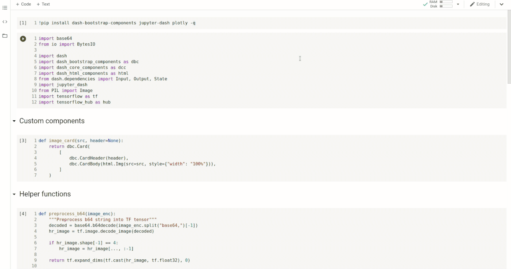

<!--
To get started, replace
Dash Image Ehancing with your app name (e.g. Dash Super Cool App)
dash-image-enhancing with the short handle (e.g. dash-super-cool)

If this is in dash sample apps, uncomment the second "git clone https..." and remove the first one.
If this is in dash sample apps and you have a colab demo, uncomment the "Open in Colab" link to see the badge (make sure to create a ColabDemo.ipynb) first.

-->
# Dash Image Enhancing

[](https://colab.research.google.com/github/plotly/dash-sample-apps/blob/master/apps/dash-image-enhancing/ColabDemo.ipynb)




This app shows you how to use [Tensorflow Hub](https://www.tensorflow.org/hub) to load [ESRGAN](https://tfhub.dev/captain-pool/esrgan-tf2/1), a type of Generative Adversarial Network trained to upscale smaller images by 4x.

For optimal speed, we recommend running this app using a Nvidia GPU with sufficient memory (e.g. V100). To try this app, please use Google Colab with a GPU accelerator (access the notebook by clicking the badge above).

This works pretty well for very small images, such as [texture from older games](https://www.reddit.com/r/GameUpscale/), or scenes of nature. However, it might not work so well with human faces. We also ask you to be careful about potentially harmful biases when using this model with pictures of people, considering that this model was not thoroughly validated in terms of biases.


## Instructions

To get started, first clone this repo:
<!-- 
```
git clone https://github.com/plotly/dash-image-enhancing.git
cd dash-image-enhancing
```
 -->

```
git clone https://github.com/plotly/dash-sample-apps.git
cd dash-sample-apps/apps/dash-image-enhancing
```


Create and activate a conda env:
```
conda create -n dash-image-enhancing python=3.7.6
conda activate dash-image-enhancing
```

Then, install the gpu version of TensorFlow:
```
conda install tensorflow-gpu==2.2.0
```

And install the rest of the requirements
```
pip install -r requirements.txt
```

You can now run the app:
```
python app.py
```

and visit http://127.0.0.1:8050/.

## Contact

Interested in building or deploying apps like this? [Reach out](https://plotly.com/contact-us/) to learn more or [get a demo](https://plotly.com/get-demo) of Dash Enterprise.

