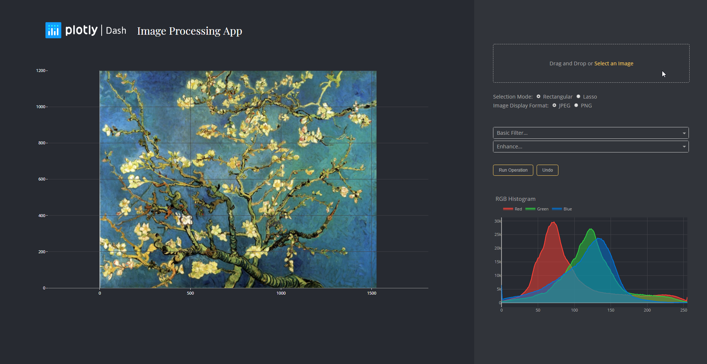

# Dash Image Processing App


This is a demo of the Dash interactive Python framework developed by [Plotly](https://plot.ly/).

Dash abstracts away all of the technologies and protocols required to build an interactive web-based application and is a simple and effective way to bind a user interface around your Python code. To learn more check out our [documentation](https://plot.ly/dash).

Try out the [demo app here](https://dash-gallery.plotly.host/dash-image-processing/).




## Getting Started
### Using the demo
This demo lets you interactively explore different image processing
filters. You can upload your own image or use the one provided with the
demo.

Filters can be applied either to the whole image, or to selections
created with one of the selection tools.

### Running the app locally

First create a virtual environment with conda or venv inside a temp folder, then activate it.

```
virtualenv dash-image-processing-venv

# Windows
dash-image-processing-venv\Scripts\activate
# Or Linux
source venv/bin/activate
```

Clone the git repo, then install the requirements with pip
```
git clone https://github.com/plotly/dash-sample-apps
cd dash-sample-apps/apps/dash-image-processing
pip install -r requirements.txt
```

Run the app
```
python app.py
```


## Development

### S3 Storage

This app uses S3 to store user input images. To use this app locally, make sure to create a `.env` file in the root directory with the following content:
```
BUCKETEER_AWS_SECRET_ACCESS_KEY=***********
BUCKETEER_AWS_ACCESS_KEY_ID=***********
BUCKETEER_BUCKET_NAME=**********
```

All this information is given when you create a bucket in AWS. For Plotly devs, the bucket name is `dash-image-processing-bucket`.

### Dash Deployment Server
If you are looking to host this app on the Dash Deployment Server, make sure:
* That you have linked a Redis database to your app.
* To configure S3 storage by adding the content of `.env` as environment variables (in Settings).

## About the app
This app wraps Pillow, a powerful image processing library in Python, and abstracts all the operations through an easy-to-use GUI. All the computation is done on the back-end through Dash, and image transfer is optimized through session-based Redis caching and S3 storage.

### Motivation
Recently, while we were experimenting with ImageJ, an image processing app in Java, we wondered if it was possible to bring two changes: port the app into a browser interface, and shift the computation to the backend (so that extremely large images can also be processed).

This is how we thought about making a Dash app that would wrap Pillow, the modern version of the Python Imaging Library. This was the natural thing to do because Dash itself is already based on Flask, and Plotly already has the graph objects for manipulating images. Adding S3 storage to keep the uploaded file and caching the operations with Redis were absolutely painless because of the easy integration with Python.

## Built With
* [Dash](https://dash.plot.ly/) - Main server and interactive components
* [Plotly Python](https://plot.ly/python/) - Used to create the interactive plots
* [Pillow](http://scikit-learn.org/stable/documentation.html) - Apply operations to images
* [Boto S3](http://boto.cloudhackers.com/en/latest/ref/s3.html) - Store User inputted images
* [Redis](https://redis.io/documentation) - Cache the user input
