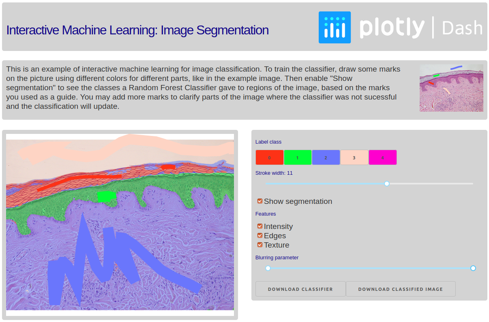

# Dash Interactive Image Segmentation

## About this app

This shows how Dash can be used to make an interactive image segmentation app.
This app trains a classifier based on initial hints given by a user. The user
can then view the estimated segmentation and add additional points to inform the
classifier which class it should have given the points in the places that it
failed.

## How to run this app locally

(The following instructions are for unix-like systems)

Clone this repository and navigate to the directory containing this `README` in
a terminal.

Create and activate a virtual environment (recommended):

```bash
python3 -m venv myvenv
source myvenv/bin/activate
```

Install the requirements

```bash
pip install -r requirements.txt
```

Run the app. An IP address where you can view the app in your browser will be
displayed in the terminal.

```bash
python app.py
```

## Screenshot



## Acknowledgements

Many thanks to Emmanuelle Gouillart for the image classifier training code.
