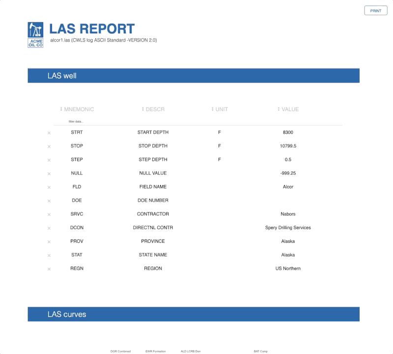

# LAStoDash

## About this app

LAStoDash is a sample Dash project that takes a [Log ASCII Standard (LAS) file](http://www.cwls.org/las/) and builds a web app to view its content and print in PDF format.

As indicated in the [LAS 2.0 Specifications](http://www.cwls.org/wp-content/uploads/2017/02/Las2_Update_Feb2017.pdf), LAS files contain sections that are marked by a ~. The [LAS file](alcor1.las) used for this app contains four of these sections, including version and wrap mode information (~V), well identification (~W), curve information (~C), and ASCII log data (~A), all of which are displayed in some format (e.g. graph, table) in the demo app and the [printable report in PDF format](alcor1.pdf).

## How to run this app locally

## Installation

Clone the repository:

```
$ git clone https://github.com/plotly/dash-sample-apps.git
```

Redirect to the respective app directory:

```
$ cd dash-sample-apps/apps/dash-lastodash
```

Install the requirements:
```
$ pip3 install -r requirements.txt
```

Find out how to run the app:
```
$ Python3 lastodash.py -h
usage: lastodash.py [-h] [--debug] lasfile

Launch a Dash app to view a LAS log.

positional arguments:
  lasfile      Log ASCII Standard (LAS) file

optional arguments:
  -h, --help   show this help message and exit
  --debug, -d  enable debug mode
```

Run the app for the LAS file `alcor1.las`:
```
$ Python3 lastodash.py alcor1.las
```

View in your browser at http://127.0.0.1:8050.

## Screenshots



See [here](alcor1.pdf) the report printed in PDF format.

## Resources

* [Dash documentation for Python](https://dash.plot.ly/)
* [Log ASCII Standard (LAS) file](http://www.cwls.org/las/)

