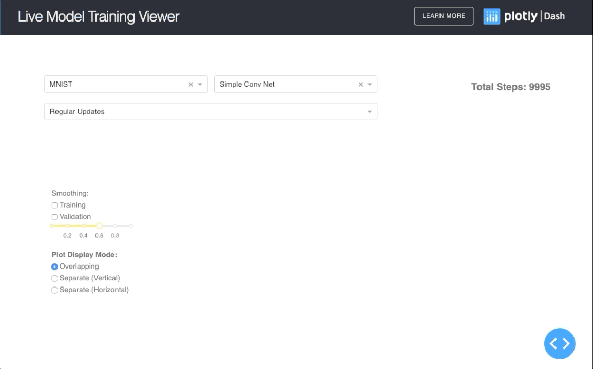
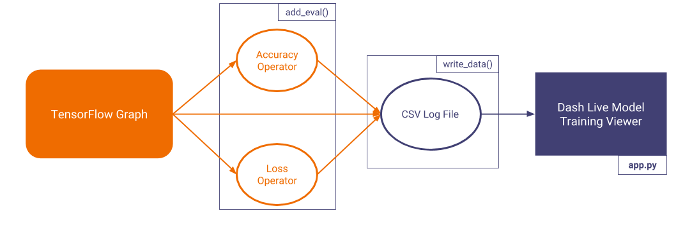
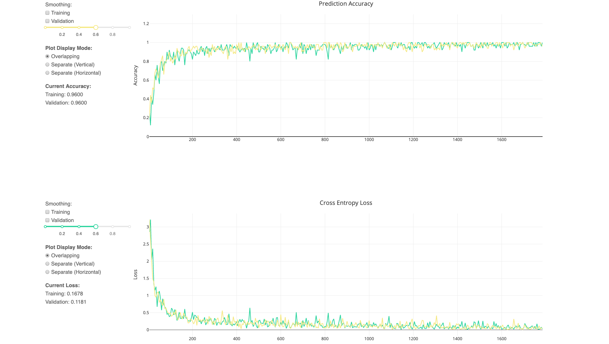
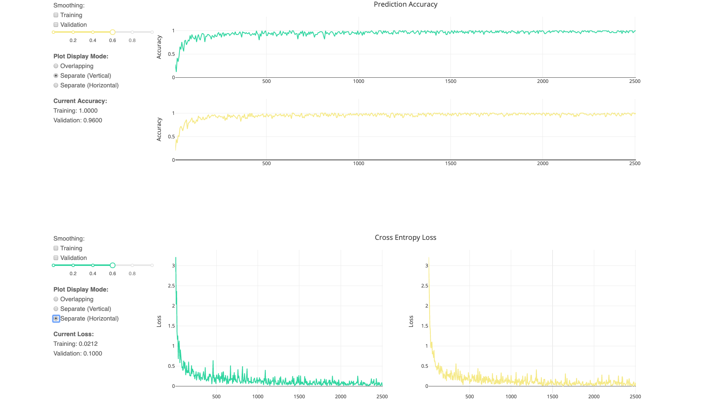

# Dash Live Model Training Viewer


[](https://github.com/plotly/dash-live-model-training/stargazers)

This is a demo of the Dash interactive Python framework developed by [Plotly](https://plot.ly/).

Dash abstracts away all of the technologies and protocols required to build an interactive web-based application and is a simple and effective way to bind a user interface around your Python code. To learn more check out our [documentation](https://plot.ly/dash).

Try out the [demo app here](https://dash-gallery.plotly.host/dash-live-model-training/).



## Getting Started

### Using the demo

To use the demo, simply choose the model and dataset for which you want to replay the training, **using the two dropdown menus at the top of the page**. For every dataset, we trained a simple 1-layer Neural Network, and a small Convolutional Neural Network that were taken from the official [Tensorflow](https://www.tensorflow.org/tutorials/layers) and [Keras](https://github.com/keras-team/keras/blob/master/examples/cifar10_cnn.py) tutorials.

### Running the app locally

First create a virtual environment with conda or venv inside a temp folder, then activate it.

```
virtualenv dash-live-model-training-venv

# Windows
dash-live-model-training-venv\Scripts\activate
# Or Linux
source dash-live-model-training-venv/bin/activate
```

Clone the git repo, then install the requirements with pip

```
git clone https://github.com/plotly/dash-sample-apps.git
cd dash-sample-apps/apps/dash-live-model-training
pip install -r requirements.txt
```

Run the app

```
python app.py
```

### How to use the app

The demo app shows how the viewer works by simulating the training process of a few basic models. If you want to use the full app with your own model, follow theses steps:

1. Import the helper functions, `add_eval()` and `write_data()` from `tfutils.py`.
2. Use `add_eval()` to add the accuracy and cross-entropy operations in your tensorflow graph, if they are not already present. It takes as input `y_`, the Tensor containing the true target, aka labels, and `y`, which contains the predicted targets, aka logits. It will return two variables, accuracy and cross_entropy.
3. Create a feed dictionary ([read more about it here](https://www.tensorflow.org/versions/r1.0/programmers_guide/reading_data)) for both your training and validation batch.
4. At every step, after running the session once, call `write_data()` to write the data in the log file. Use the feed dicts, _accuracy_ and _cross_entropy_ generated in the previous steps as input. If the output log file is renamed, update the _LOGFILE_ variable inside `app.py` as well to reflect the changes.
5. Run `app.py`, and open the given link.

Make sure that you correctly clone the repo with all the required libraries. You also need the latest version of Tensorflow and Sci-kit Learn.

## About the app

### What does the app do?

For the majority of Deep Learning models, it is extremely helpful to keep track of the accuracy and loss as it is training. At the moment, the best application to do that is [Tensorboard](https://www.tensorflow.org/programmers_guide/summaries_and_tensorboard), which is a collection of visualization tools (metrics plots, image examples, graph representation, weight histogram, etc.) useful to debug and monitor the training of your model.

_Dash's Live Model Training Viewer_ is a compact visualization app that monitors core metrics of your **Tensorflow model** during training. It complements the Tensorboard by offering the following:

- **Real-time visualization**: The app is designed to visualize your metrics as they are updated inside your model.
- **Small and Lightweight**: The viewer loads a small number of important visualization, so that it loads and runs quickly.
- **Simple to use**: For simpler tensorflow models, all you need to do is to call `add_eval` to add the accuracy and cross entropy operations in the graph, and generate a log of the metrics using `write_data`. Both functions are inside `tfutils.py`, and examples are included in the `examples` directory.
- **Easy to modify**: The app is stored inside one module, and is written in under 400 lines. You can quickly modify and improve the app without breaking anything.
- **Plotly Graphs and Dash Integration**: Easily integrate the app into more complex Dash Apps, and includes all the tools found in Plotly graphs.



At the moment, the logging only works for iterative Tensorflow models. We are planning to extend it for PyTorch. You are encouraged to port the logging function (which is a simple csv logging) to Keras, Tensorflow's high-level API, MXNet, etc.

## Built With

- [Dash](https://dash.plot.ly/) - Main server and interactive components
- [Plotly Python](https://plot.ly/python/) - Used to create the interactive plots

## Authors

- **Celine Huang** [@celinehuang](https://github.com/celinehuang)
- **Chris Jeon** [@christopherjeon](https://github.com/christopherjeon)
- **Xing Han Lu** - _Initial Work_ - [@xhlulu](https://github.com/xhlulu)

See also the list of [contributors](https://github.com/your/project/contributors) who participated in this project.

## Screenshots





