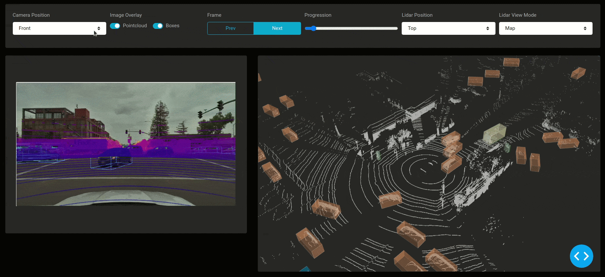

<!--
To get started, replace
Dash Lyft Perception Explorer with your app name (e.g. Dash Super Cool App)
dash-lyft-explorer with the short handle (e.g. dash-super-cool)

If this is in dash sample apps, uncomment the second "git clone https..." and remove the first one.
If this is in dash sample apps and you have a colab demo, uncomment the "Open in Colab" link to see the badge (make sure to create a ColabDemo.ipynb) first.

-->
# Dash Lyft Perception Explorer
<!-- 
[](https://colab.research.google.com/github/plotly/dash-sample-apps/blob/master/apps/dash-lyft-explorer/ColabDemo.ipynb)
 -->

This shows how to build a real-time AV explorer from scratch using Dash Deck and the Lyft perception dataset. The code is easily customizable and also compatible with 3D detection models written in Python. 


💻 [Demo](https://dash-gallery.plotly.host/dash-lyft-explorer/)

📰 [Article](https://medium.com/plotly/the-history-of-autonomous-vehicle-datasets-and-3-open-source-python-apps-for-visualizing-them-afee9d13f58a)



## Instructions

To get started, first clone this repo:

```
git clone https://github.com/plotly/dash-sample-apps.git
cd dash-sample-apps/apps/dash-lyft-explorer
```


Create and activate a conda env:
```
conda create -n dash-lyft-explorer python=3.7.6
conda activate dash-lyft-explorer
```

Or a venv (make sure your `python3` is 3.6+):
```
python3 -m venv venv
source venv/bin/activate  # for Windows, use venv\Scripts\activate.bat
```

Install all the requirements:

```
pip install -r requirements.txt
```

You can now run the app:
```
python app.py
```

and visit http://127.0.0.1:8050/.

## Contact

Interested in building or deploying apps like this? [Reach out](https://plotly.com/contact-us/) or [get a demo](https://plotly.com/get-demo).