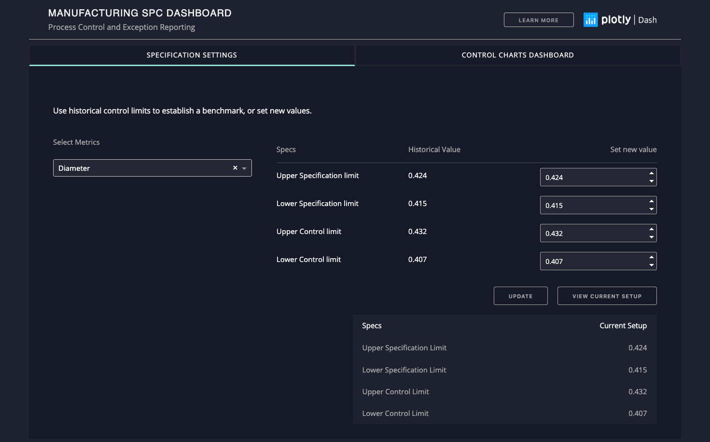
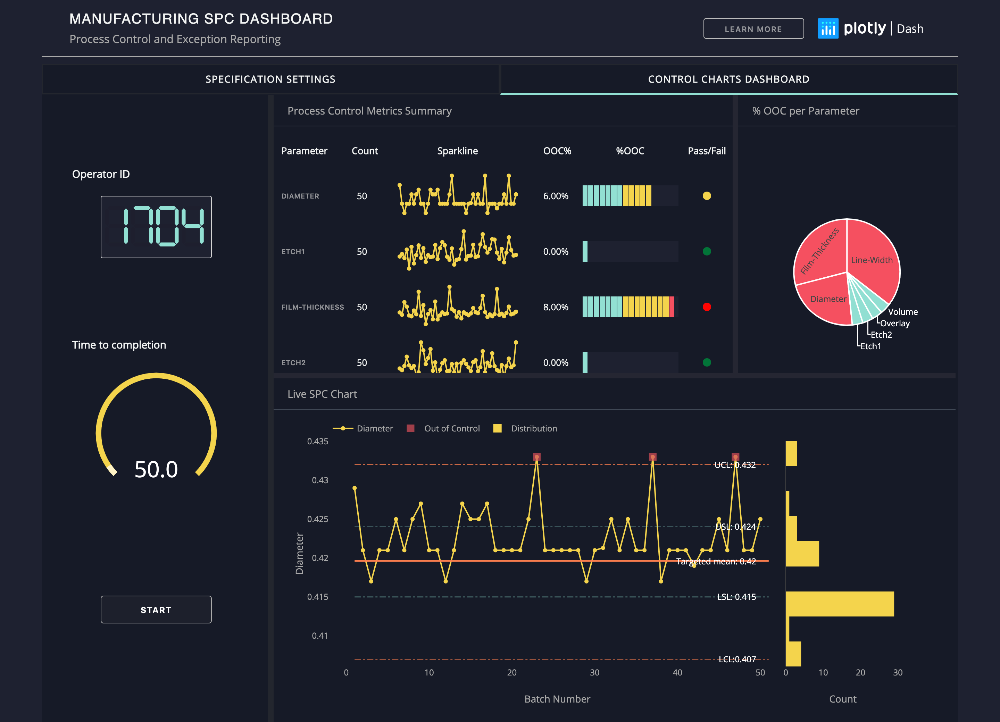

# Manufacturing SPC Dashboard

## Introduction
`Dash-manufacture-spc-dashboard` is a dashboard for monitoring real-time process quality along manufacture production line. 
This is a demo of Dash interactive Python framework developed by [Plotly](https//plot.ly/).

## Screenshots





## Built With
* [Dash](https://dash.plot.ly/) - Main server and interactive components 
* [Plotly Python](https://plot.ly/python/) - Used to create the interactive plots
* [Dash DAQ](https://dash.plot.ly/dash-daq) - Styled technical components for industrial applications

## Requirements
We suggest you to create a separate virtual environment running Python 3 for this app, and install all of the required dependencies there. Run in Terminal/Command Prompt:

```
git clone https://github.com/plotly/dash-sample-apps.git
cd dash-sample-apps/apps/dash-manufacture-spc-dashboard/
python3 -m virtualenv venv
```
In UNIX system: 

```
source venv/bin/activate
```
In Windows: 

```
venv\Scripts\activate
```

To install all of the required packages to this environment, simply run:

```
pip install -r requirements.txt
```

and all of the required `pip` packages, will be installed, and the app will be able to run.


## How to use this app

Run this app locally by:
```
python app.py
```
Open http://0.0.0.0:8050/ in your browser, you will see a live-updating dashboard.

Click on **Learn more** button to learn more about how this app works.

## What does this app show

Click on buttons in `Parameter` column to visualize details of trendline on the bottom panel.

Click `Start` button, trends are updated every two seconds to simulate real-time measurements. The Sparkline on top panel and Control chart on bottom panel show Shewhart process control using mock data. Data falling outside of control limit are signals indicating 'Out of Control(OOC)', and will 
trigger alerts instantly for a detailed checkup. 

Operators may stop measurement by clicking `Stop` button, and edit specification parameters for selected process line(metrics) in Specification Tab.

## Resources and references
* [Shewhart statistical process control](https://en.wikipedia.org/wiki/Shewhart_individuals_control_chart)
* [Dash User Guide](https://dash.plot.ly/)

