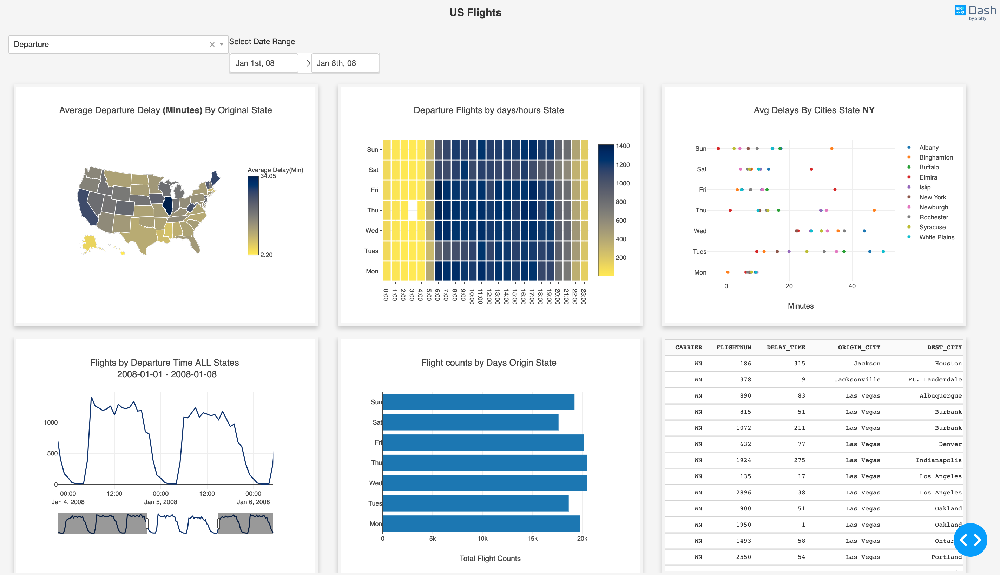

# dash-mapd-demo

## About this app

This Dash app updates real-time visual analytics by constantly querying a remote Omnisci(MapD) SQL Engine. 

## About this dataset

The public dataset used in this app, "flight_2008_10k", includes every single record of US airline flights known by the Bureau of Transportation Statistics from 2008-01-03 to 2008-01-07. By default, it can be loaded from the `insert_sample_data` script during the Omnisci server installation. A [jupyter notebook](https://github.com/plotly/dash-mapD-demo/blob/master/flights_data_clean.ipynb) has been included to showcase tabular structure and query results from this dataset.

## Requirements

* Python 3
* Omnisci server installation [Guide to install Omnisci](https://www.omnisci.com/docs/latest/4_docker.html) 

## How to run this app

To run this app, you will need a self-hosted Omnisci SQL engine running on `localhost:6274` with the default logins. [follow this guide](https://github.com/plotly/dash-mapD-demo/blob/master/docker/README.md) to install a test database locally by dockerfile.

We suggest you to create a virtual environment for running this app with Python 3. Clone this repository 
and open your terminal/command prompt in the root folder.

```
git clone https://github.com/plotly/dash-sample-apps.git
cd dash-sample-apps/apps/dash-mapd-demo
python3 -m virtualenv venv

```
In Unix system:
```
source venv/bin/activate

```
In Windows: 

```
venv\Scripts\activate
```

Install all required packages by running:
```
pip install -r requirements.txt
```

Run this app locally by:
```
python app.py
```

Click on individual state from choropleth map to visualize state-specific flight delays in other plots and datatable, drag along time-series, click on 
single bar or drag along scatters to know flight details in the table. 

## Screenshot & Screencast




## Resources

* [Dash](https://dash.plot.ly/)
* [Omnisci Core](https://www.omnisci.com/platform/core)
* [PymapD Python Client](https://pymapd.readthedocs.io/en/latest/)
* Inspired by [Omnisci Demo app](https://www.omnisci.com/demos/flights/#/dashboard/4?_k=ks7460).

