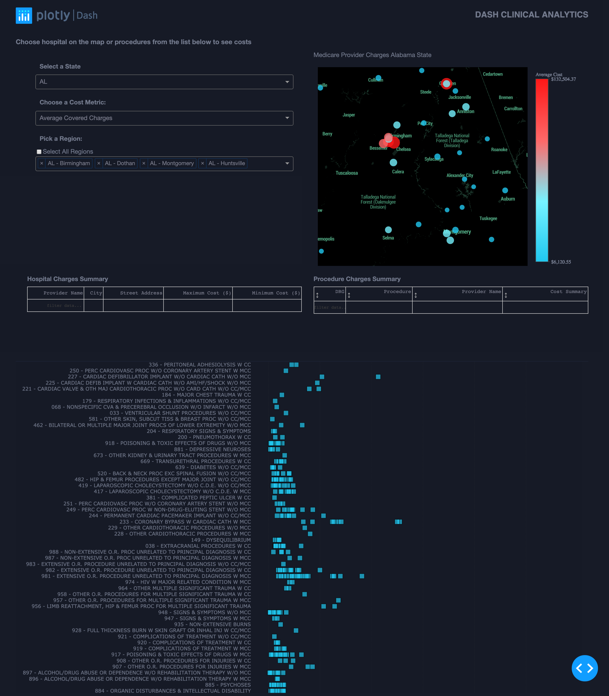

# dash-medical-provider-charges

## About this app

This app creates a dashboard to visualize medical provider charges/costs from US hospitals and clinics.

Data are downloaded from open data platform by [Centers for Medicare & Medicaid Services](https://www.cms.gov/Research-Statistics-Data-and-Systems/Statistics-Trends-and-Reports/Medicare-Provider-Charge-Data/Inpatient2016.html).  
This dataset covers national and state summary of inpatient charges in Fiscal Year 2016. Information includes utilization, payment(total and medicare payment), hospital-specific charges for all medicare-certified hospital facilities.

Detailed explanation on columns could be found [here](https://data.cms.gov/Medicare-Inpatient/Inpatient-Prospective-Payment-System-IPPS-Provider/fm2n-hjj6)

## How to run this app locally

To run this app locally, clone this repository and open this app folder in your terminal/Command Prompt. We suggest you to create a virtual environment for installation of required packages for this app.

```
cd dash-medical-provider-charges
python3 -m virtualenv venv

```
In Unix System:
```
source venv/bin/activate

```

In Windows: 

```
venv\Scripts\activate
```

Install all required packages by running:
```
pip install -r requirements.txt
```

Run this app locally by:
```
python app.py
```

## How to use this app

Select state, cost metric and region to visualize average charges or payments(for all medical procedures) on the map. Click on individual hospital from map to highlight its procedure-specific charges on the bottom chart. You may also click or select individual data from bottom plot to view its geological location, as well as charges/payment summaries from datatable.

## Screenshot



## Resources
* [Dash](https://dash.plot.ly/)
* Inspired by [tableau template](https://www.tableau.com/solutions/workbook/improve-patient-satisfaction-improving-cycle-time)
