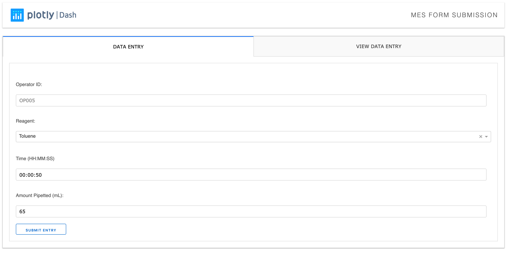
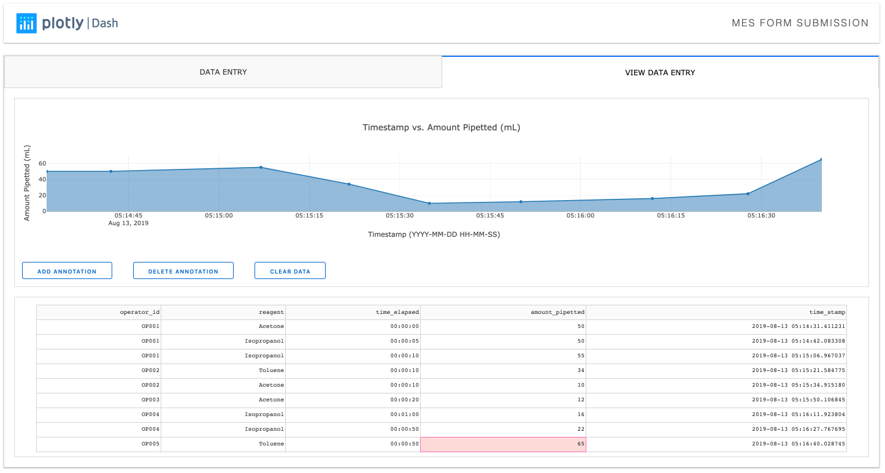

# Dash MES Form Submission

## About this app

This app allows the user to create a SQL database by inputting data. This data upon submission is used to update an interactive plot and data table for visualization.

## Screenshots





## How to run this app

(The following instructions apply to Posix/bash. Windows users should check
[here](https://docs.python.org/3/library/venv.html).)

First, clone this repository and open a terminal inside the root folder.

Create and activate a new virtual environment (recommended) by running
the following:

```bash
python3 -m venv myvenv
source myvenv/bin/activate
```

Install the requirements:

```bash
pip install -r requirements.txt
```
Run the app:

```bash
python app.py
```
Open a browser at http://127.0.0.1:8050

## What the app does

The user enters data in the required fields on the `DATA ENTRY` tab using the `SUBMIT` button, the app then directs the user to the `VIEW DATA` tab. The `VIEW DATA` shows the automatically plotted graph and data table which is produced from an automatically created SQL database. To enter additional data the user must then go back to the `DATA ENTRY` tab. The user has the option to add and delete annotations to the plot using the `ADD ANNOTATION` and `DELETE ANNOTATION` buttons, the `CLEAR` button clears the SQL data base. 

## Resources

- To learn more about Dash, check out our [documentation](https://plot.ly/dash).

