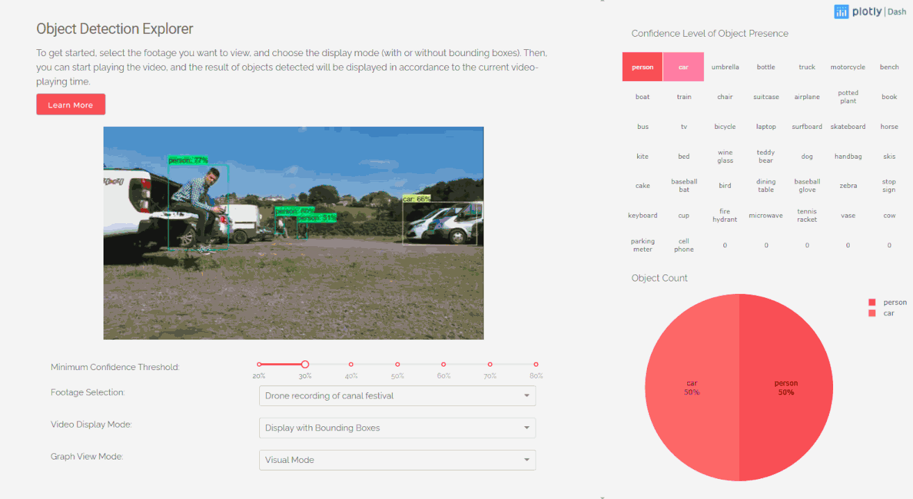
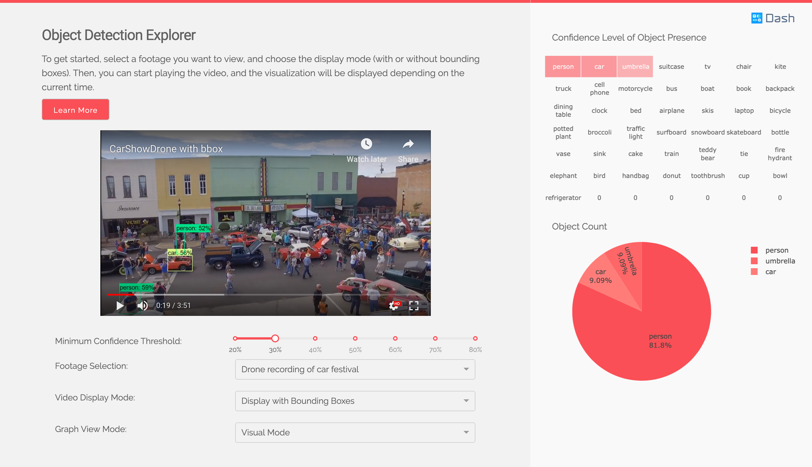
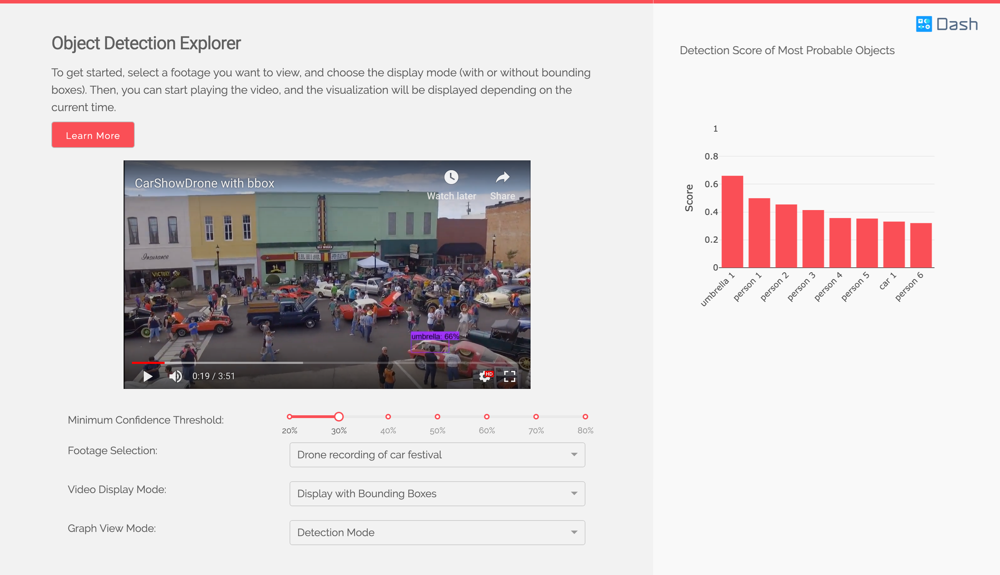

# Object Detection

This is a demo of the Dash interactive Python framework developed by [Plotly](https://plot.ly/).

Dash abstracts away all of the technologies and protocols required to build an interactive web-based application and is a simple and effective way to bind a user interface around your Python code. To learn more check out our [documentation](https://plot.ly/dash).

Try out the [demo app here](https://dash-gallery.plotly.host/dash-object-detection/).



## Getting Started

### Using the demo

To get started, select the footage you want to view, and choose the display mode (with or without bounding boxes). Then, you can start playing the video, and the result of objects detected will be displayed in accordance to the current video-playing time.

### Running the app locally

First create a virtual environment with conda or venv inside a temp folder, then activate it.

```
virtualenv dash-object-detection

# Windows
dash-object-detection\Scripts\activate
# Or Linux
source venv/bin/activate
```

Clone the git repository, and install the requirements with pip

```
git clone https://github.com/plotly/dash-sample-apps.git
cd dash-sample-apps/apps/dash-object-detection
pip install -r requirements.txt
```

Run the app

```
python app.py
```

## About this app

The videos are displayed using a community-created Dash video component. You can find reference to the [source code here](https://github.com/plotly/dash-player).

All videos used are open-sourced under Creative Commons. The [original links can be found here](data/original_footage.md).

### Model

The object detection model is the MobileNet v1, made by Google and trained on the COCO dataset. You can find their implementation on their [official Github repo](https://github.com/tensorflow/models/blob/master/research/slim/nets/mobilenet_v1.md). You are encouraged to try this app with other models.

### Bounding Box Generation

The data displayed in the app are pre-generated for demo purposes. To generate the csv files containing the objects detected for each frame, as well as the output video with bounding boxes, please refer to `utils/generate_video_data.py`. You will need the latest version of tensorflow and OpenCV, as well as the frozen graph `ssd_mobilenet_v1_coco`, that you can [download in the Model Zoo](https://github.com/tensorflow/models/blob/master/research/object_detection/g3doc/detection_model_zoo.md). Make sure to place the frozen graph inside the same folder as `generate_video_data.py`, i.e. `utils`.

## Built With

- [Dash](https://dash.plot.ly/) - Main server and interactive components
- [Plotly Python](https://plot.ly/python/) - Used to create the interactive plots
- [Dash Player](https://github.com/plotly/dash-player) - Used to control and play videos using Dash
- [OpenCV](https://docs.opencv.org/) - Create the video with bounding boxes
- [Tensorflow](https://www.tensorflow.org/api_docs/) - Generate the bounding box data

## Authors

- **Xing Han Lu** - _Initial Work_ - [@xhlulu](https://github.com/xhlulu)
- **Yi Cao** - _Restyle_ - [@ycaokris](https://github.com/ycaokris)

## Screenshots




