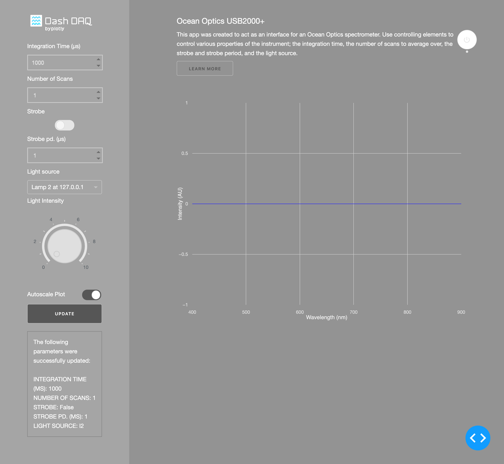
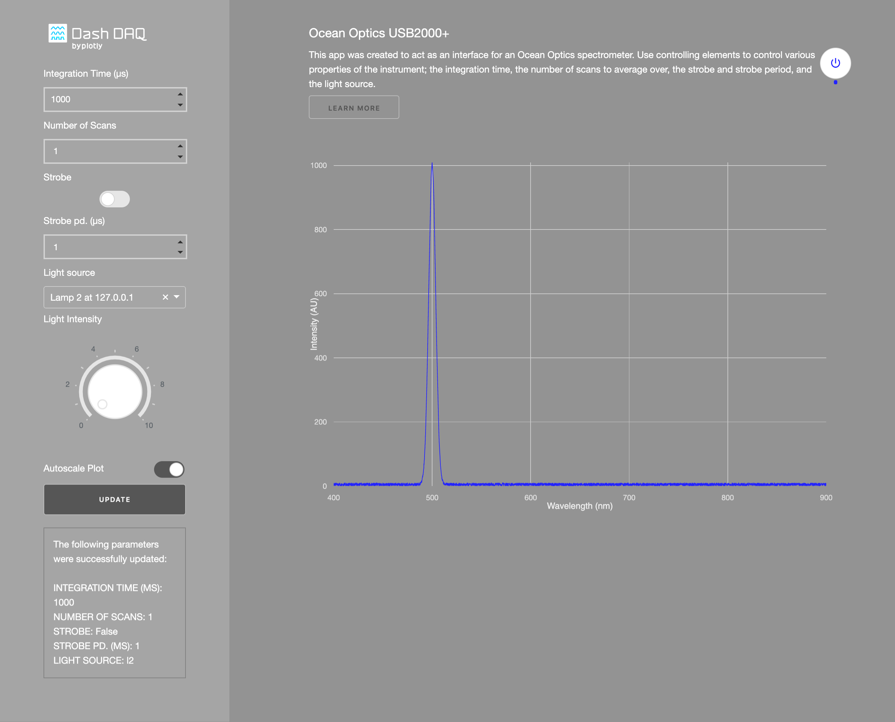
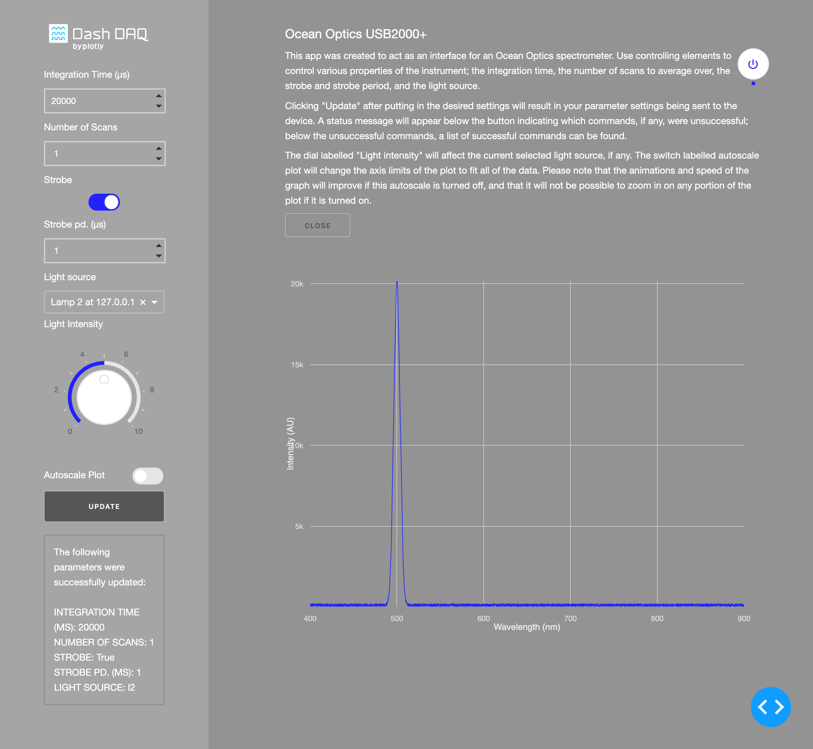

# Dash Ocean Optics

## Introduction
`dash-ocean-optics` is an app created to control and read data from [Ocean Optics](https://oceanoptics.com) spectrometers. Try the app out yourself at [dash-gallery](https://dash-gallery.plotly.host/dash-ocean-optics) and learn more about this app from our [blog entry](https://www.dashdaq.io/control-an-ocean-optics-spectrometer-in-python)!

### Absorption Spectroscopy
Certain wavelengths of electromagnetic radiation correspond to frequencies that allow the electrons in certain atoms to transition to higher or lower energy levels; as these wavelengths are absorbed by the sample, the resulting spectrum can yield insight into the chemical composition of the sample. Read more about spectroscopy [here](https://en.wikipedia.org/wiki/Spectroscopy). 

### dash-daq
[Dash DAQ](https://dash.plot.ly/dash-daq) is a data acquisition and control package built on top of Plotly's [Dash](https://plot.ly/dash/).

## Requirements
It is advisable	to create a separate conda/pip environment running Python 3 for the app and install all of the required packages there. To do so, run:

```
conda create -n	[your environment name] python=3.6
```
or 
```
virtualenv [your environment name]
```

```
source activate [your environment name]
```

To install all of the required packages to this conda environment, simply run:

```
pip install -r requirements.txt
conda install -c poehlmann python-seabreeze
```

and all of the required `pip` packages, as well as the [`python-seabreeze`](https://github.com/ap--/python-seabreeze/) package, will be installed, and the app will be able to run.

## How to use the app
Run the app with: 

``` 
python3 app.py
```
If you would like to run the app in demo mode, then run:

```
python3 app.py demo
```

Then, navigate to `localhost:8050` in your browser and you should see something like this: 



The controls are all disabled until the "on" button is pressed:



Then, the live spectrometer data should appear on the plot, and the model of the spectrometer should appear above the plot. Note that the "autoscale" feature is on by default. To improve the speed and animations of the graph, it is necessary to turn this feature off. 


The controls below the plot will allow you to change parameters of the spectrometer. The dial labelled "light intensity" to the right of the plot will allow you to adjust the intensity of the light source selected below. Note that the dial is disabled until a light source is selected from the appropriate dropdown menu.



### Controls
* int. time (us) - The integration time, in microseconds.
* number of scans - The number of scans to average over.
* strobe - Enables/disables the continuous strobe.
* strobe pd. (us) - The period of the continuous strobe, in microseconds.
* light source - The light source to be used.


Once they have been changed to the appropriate settings, the "update" button to the right of the plot should be pressed, and each of the settings will be sent to the spectrometer one-by-one. The window below the "update" button displays the commands that failed, with the associated error messages, and the commands that succeeded, with the new values.

## Advanced

### Adding your own controls
In order to add a control yourself, you must:
* Create a new `Control` object in `app.py`; note that the `component_attr` dictionary must have the key `id` in order for the callbacks to be properly triggered.
* Append this new object to the list `controls` within `app.py`.
* Add the key-value pair `"[dash component id]", "[function object associated with control]"` to the dictionary `self._controlFunctions` in the `PhysicalSpectrometer` and `DemoSpectrometer` class definitions (if you don't want this control to have any effect in the demo mode, then set the value to `"empty_control_demo"`).

### Adding your own spectrometers
Although this app was created for Ocean Optics spectrometers, it is possible to use it to interface with other types of spectrometers. The abstract base class `DashOceanOpticsSpectrometer` contains a set of methods and properties that are necessary for the spectrometer to properly interface with the app. 
Please note that you should be using the communication and spectrometer locks as necessary to avoid issues with two different callbacks trying to modify/read the same thing concurrently. 
