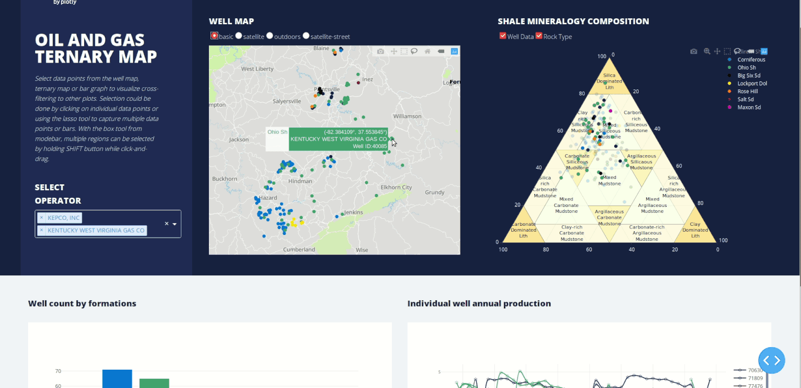
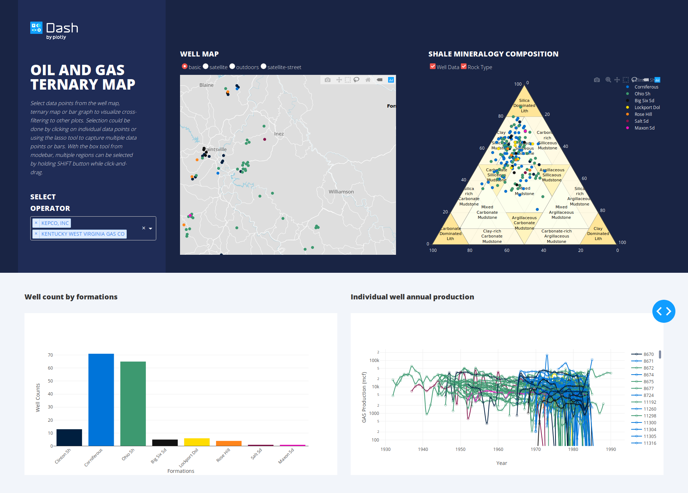

## Dash-oil-gas-ternary

`dash-oil-gas-ternary` creates a dashboard for mineral composition evaluations from natural gas wells.  
By pairing geographic map of well locations with ternary diagram, this app helps geologists to find out results of gas wells with relationship to formations or rock types.
This is a demo of Dash interactive Python framework developed by [Plotly](https//plot.ly/).



## Screenshots



## Requirements
We suggest you to create a separate virtual environment running Python 3 for this app, and install all of the required dependencies there. Run in Terminal/Command Prompt:

```
git clone https://github.com/plotly/dash-oil-gas-ternary.git
cd dash-oil-gas-ternary
python3 -m virtualenv venv
```
In UNIX system: 

```
source venv/bin/activate
```
In Windows: 

```
venv\Scripts\activate
```

To install all of the required packages to this environment, simply run:

```
pip install -r requirements.txt
```

and all of the required `pip` packages, will be installed, and the app will be able to run.

## How to use the app
Run this app locally by:
```
python app.py
```
Open http://127.0.0.1:8050/ in your browser.

Select data points from well map, ternary map or bar graph to visualize cross-filtering to other plots.
Selection could be done by clicking on individual data points or using the lasso tool to capture multiple data points or bars. Hold SHIFT
button while click-and-drag for multi-region selection.

## Data source
Historical shale gas production data for selected Devonian Ohio Shale wells http://www.uky.edu/KGS/emsweb/kyogfaq/kyogfaq10.html
