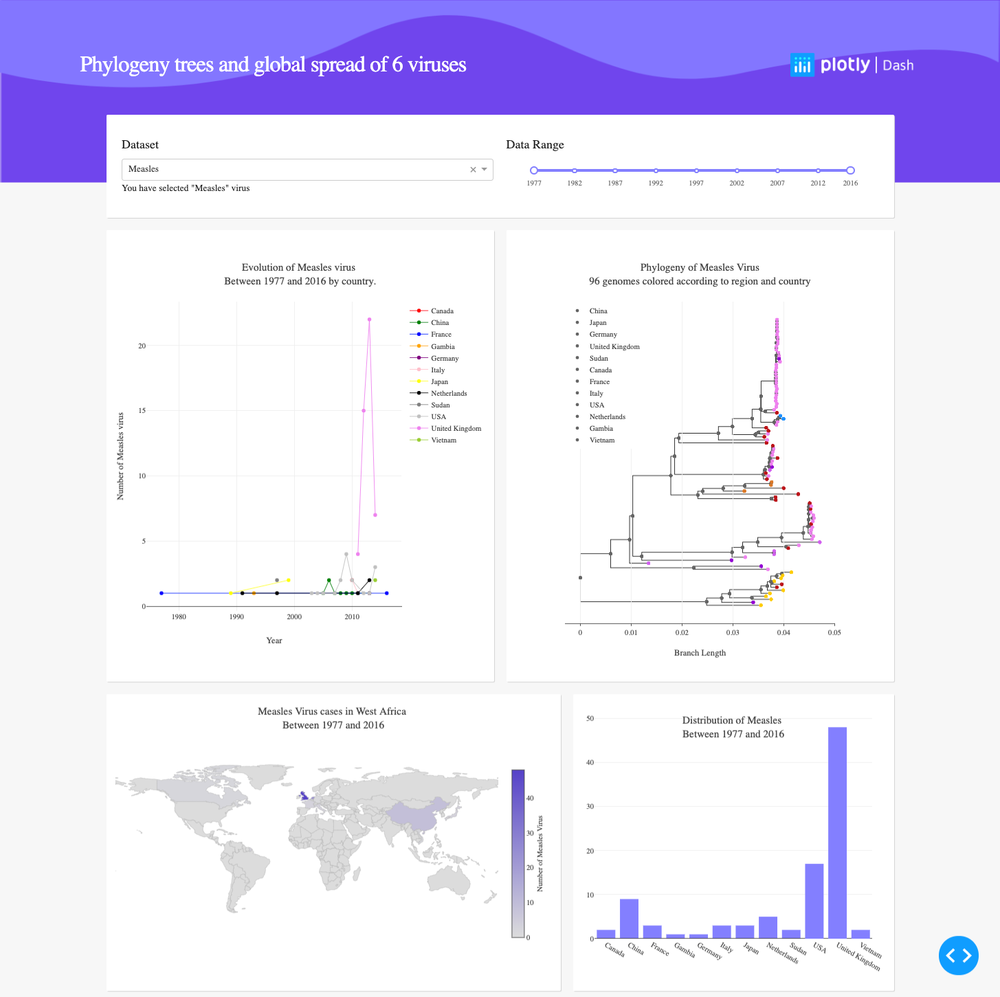

# Dash: Virus Phylogenetic Tree

This is a demo of the Dash interactive Python framework developed by [Plotly](https://plot.ly/).

Dash abstracts away all of the technologies and protocols required to build an interactive web-based application and is a simple and effective way to bind a user interface around your Python code.

To learn more check out our [Dash User Guide](https://plot.ly/dash).

## Introduction

👉 [Explore this app on Dash App Manager](https://dash-gallery.plotly.host/dash-phylogeny/).

## Requirements
- Python 3
- The list of all packages is listed in the `requirements.txt`;

## How to use the app

We suggest you clone this app and create a virtual environment to run this app locally: 

```
python3 -m venv myvenv
source myvenv/bin/activate
```

Install all dependencies: 

```
pip install -r requirements.txt
```
The command needed to run the app:
```
python app.py
```

In the [online app](https://dash-gallery.plotly.host/dash-phylogeny/), you can select a virus, and the evolution of the virus as a phylogeny tree will display with a map and time series of the virus's global spread.

## Resources

External packages used in the project:
- biopython (https://biopython.org/wiki/Documentation)
- nominatim (https://geopy.readthedocs.io/en/stable/)

## Screenshots
The following are screenshots for the app in this repo:



### [Technique/field associated with the instrument]

This Dash app was inspired by the excellent [Nextstrain project](https://nextstrain.org/zika?dmin=2014-06-17).


