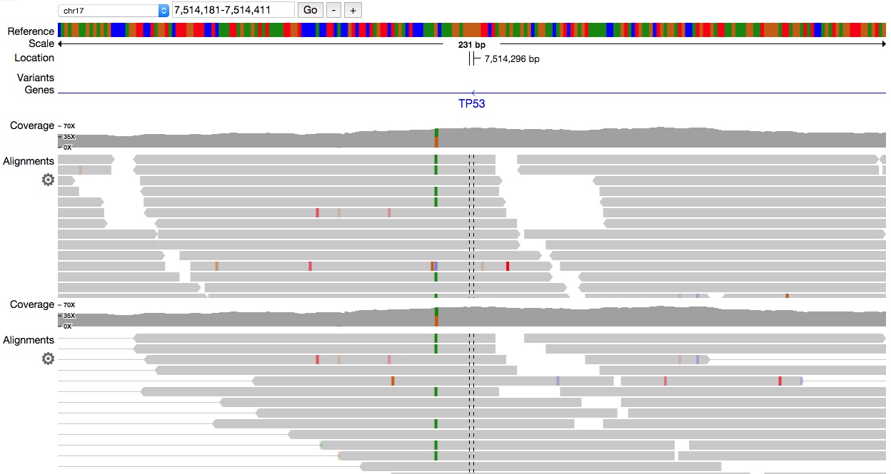
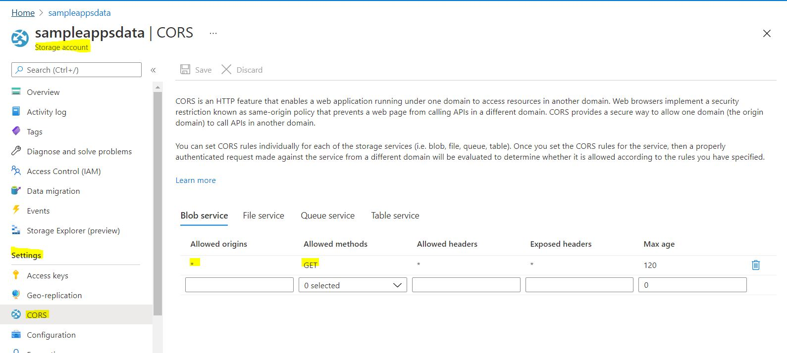
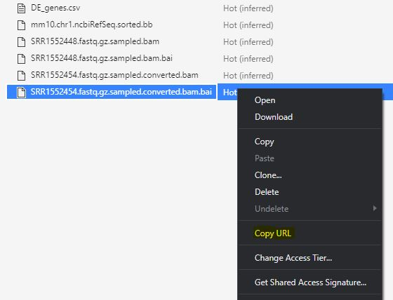

# Dash Pileup Demo

This is a demo for the [Dash Bio](https://github.com/plotly/dash-bio) Pileup component, originally published [here](https://github.com/plotly/dash-bio/tree/master/tests/dashbio_demos/dash-pileup).

## Adding your own data

To add your own data, we recommend a data storage service such as Azure Storage to host your data on the cloud. On a high level, the steps will be:

1. Generate your RNA data
2. Create a new storage account ([tutorial](https://docs.microsoft.com/en-us/azure/storage/common/storage-account-create?tabs=azure-portal))
3. Create a new container and upload your files ([tutorial](https://docs.microsoft.com/en-us/azure/storage/blobs/storage-quickstart-blobs-portal))
4. Enable CORS for your storage account through the [Azure Portal](https://portal.azure.com/) (see [discussions](https://stackoverflow.com/a/59208718/13837091))
   1. Select your desired "Storage Account" through the portal
   2. On the sidebar, choose "Settings - CORS"
   3. Allow origins corresponding to where your app will be hosted.
   
   

5. Retrieve the URL of the files by right clicking on each and selecting "Copy URL"
   
   

6. Update the `rna_differential` function inside *app.py* such that each link corresponds to the URL of your file uploaded to the Azure Storage container.
