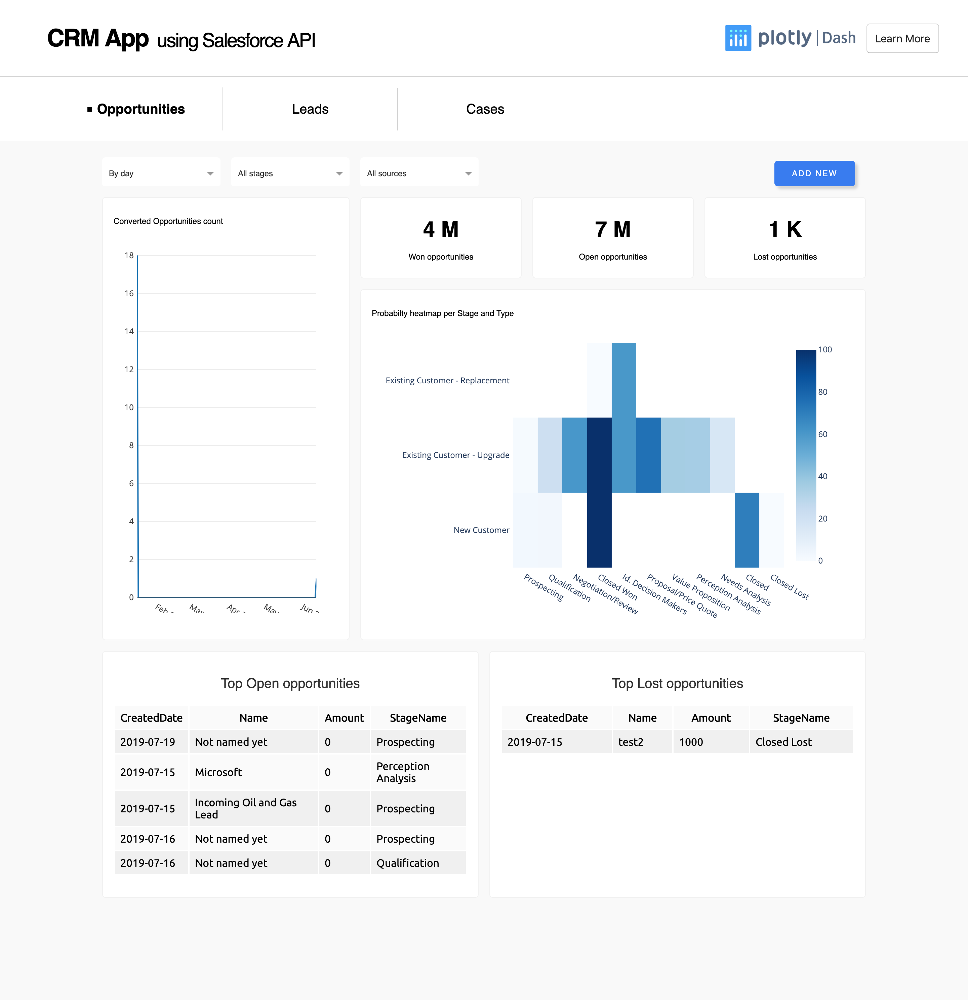
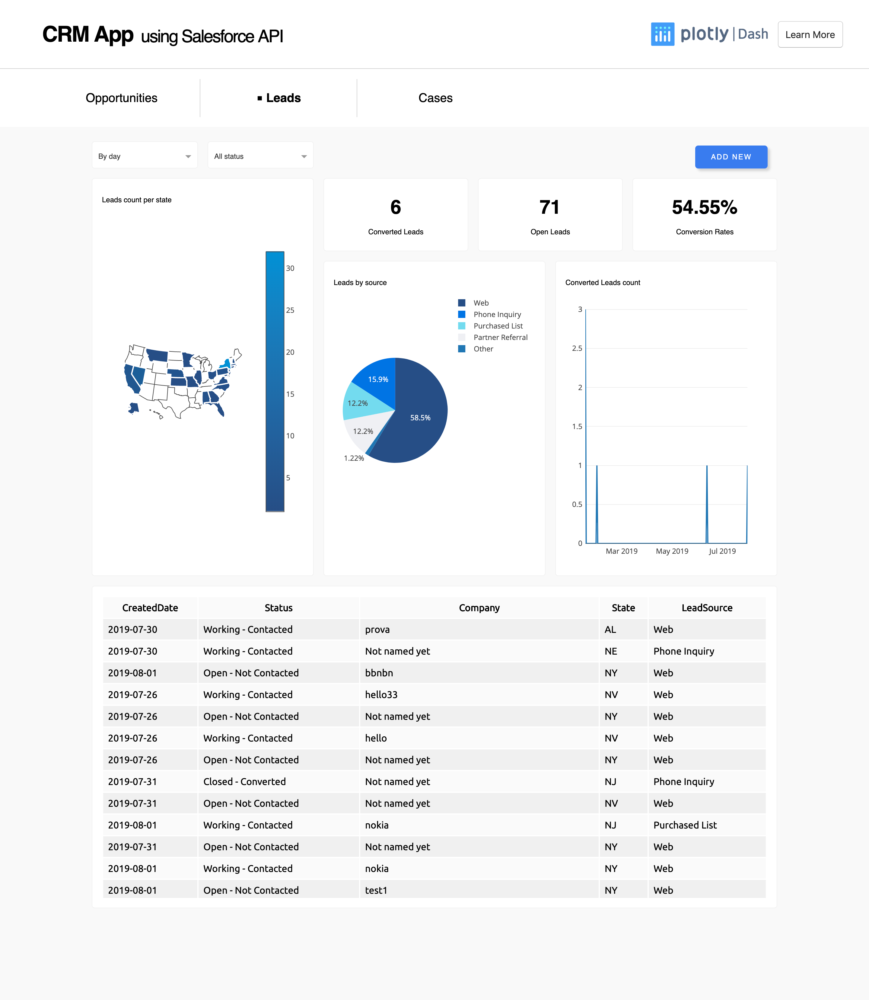
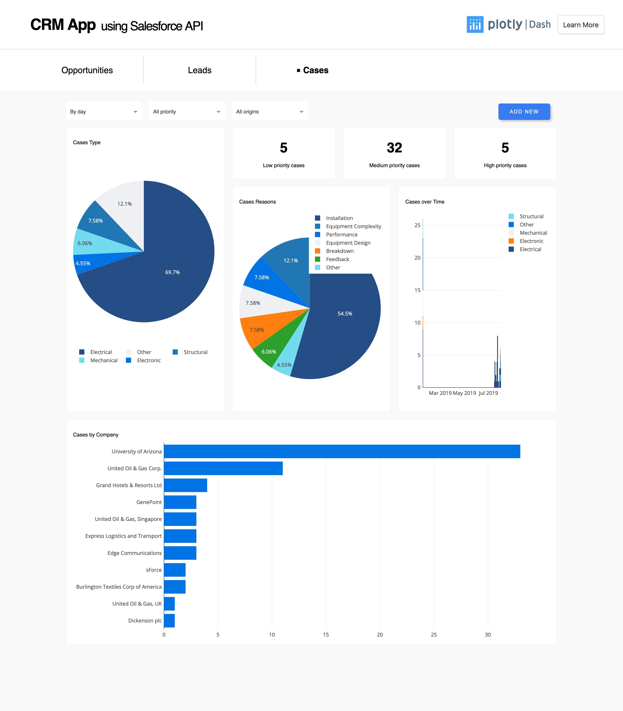
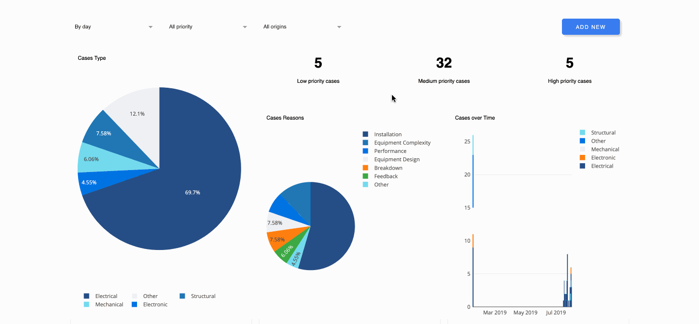

# Dash Salesforce CRM

This is a demo of the Dash interactive Python framework developed by [Plotly](https://plot.ly/).

Dash abstracts away all of the technologies and protocols required to build an interactive web-based application and is a simple and effective way to bind a user interface around your Python code.

To learn more check out our [documentation](https://plot.ly/dash).

## Getting Started

### Running the app locally

First create a virtual environment with conda or venv inside a temp folder, then activate it.

```
virtualenv venv

# Windows
venv\Scripts\activate
# Or Linux
source venv/bin/activate

```

Clone the git repo, then install the requirements with pip

```

git clone https://github.com/plotly/dash-sample-apps
cd dash-sample-apps/apps/dash-salesforce-crm
pip install -r requirements.txt

```

To run the app, please create a SalesForce developer account (link is in the `About the App` section). There is an example of how the bash script should look like in the `secrets.example.sh` file. Be sure to create a new file named `secrets.sh` file and put your credentials in the file. Therefore, your credentials will not get pushed to github as the `secrets.sh` file is in the `.gitignore`.

Run the app

```
source secrets.sh
python index.py

```

## About the App

This app uses Salesforce API in order to implement a custom CRM dashboard. The API is used via the module [Simple-Salesforce](https://pypi.org/project/simple-salesforce/). Create a free SalesForce developer trial account: [https://developer.salesforce.com/signup](https://developer.salesforce.com/signup) to utilize this API and run the app.

## Built With

- [Dash](https://dash.plot.ly/) - Main server and interactive components
- [Plotly Python](https://plot.ly/python/) - Used to create the interactive plots

## Screenshots

The following are screenshots for the app in this repo:








