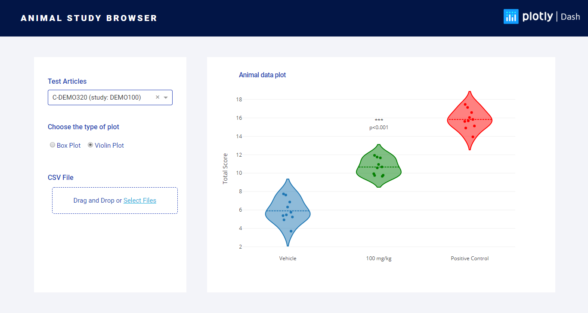

# Animal Study Browser

## About this app

This app displays the results of a study comparing several treatment 
groups and optionally calculates p-values. Data from one or more
studies are loaded from a csv file containing the following 
column headers (case sensitive):

* *study_id*
* *group_id*
* *group_type*
* *reading_value*

The file should have one row for each subject. If a group has
group_type "control", it will be compared to the other groups using a t-test.
The group_type "reference" will suppress this calculation. 

The app will also recognize the following columns, providing
some additional functionality:

* *subject_id* - displayed on hover-over of data points
* *test_article* - displayed in the study selection drop-down
* *group_name* - replaces group_id on the x-axis
* *reading_name* - y-axis title 

Animal studies are often used to determine if a drug candidate (i.e., test article) 
has the desired effect in disease model. For example, a study 
could measure the ability of a compound to reduce tumor size in a mouse cancer 
model or control blood sugar in diabetic rats. Studies are almost always designed to
compare against untreated controls and test for statistical significance. 

## How to run this app

(The following instructions apply to Windows command line.)

To run this app first clone repository and then open a terminal to the app folder.

```
git clone https://github.com/plotly/dash-sample-apps.git
cd dash-sample-apps/apps/studybrowser
```

Create and activate a new virtual environment (recommended) by running
the following:

On Windows

```
virtualenv venv 
\venv\scripts\activate
```

Or if using linux

```bash
python3 -m venv myvenv
source myvenv/bin/activate
```

Install the requirements:

```
pip install -r requirements.txt
```
Run the app:

```
python app.py
```
You can run the app on your browser at http://127.0.0.1:8050


## Screenshots



## Resources

To learn more about Dash, please visit [documentation](https://plot.ly/dash).
