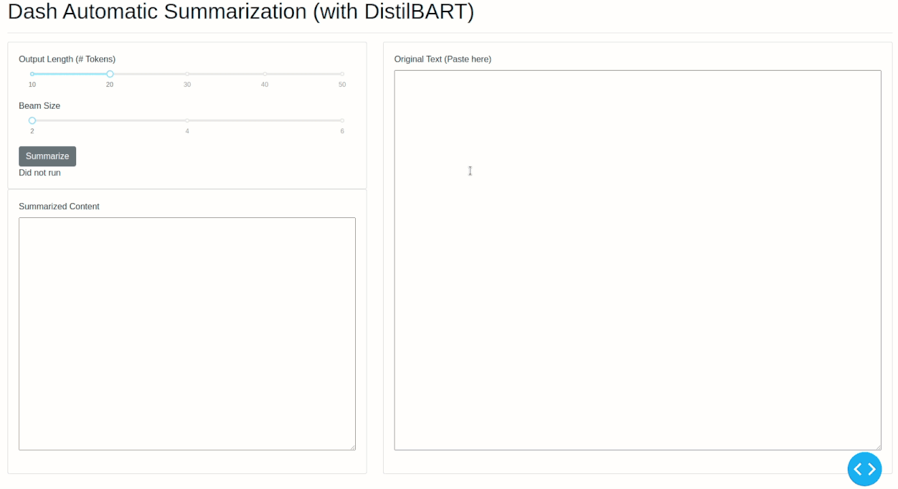

# Dash Summarization
[](https://colab.research.google.com/github/plotly/dash-sample-apps/blob/master/apps/dash-summarize/ColabDemo.ipynb)

This app lets you use [DistilBART](https://huggingface.co/sshleifer/distilbart-xsum-12-3) for automatically summarizing a piece of text.



## Instructions

To get started, first clone this repo:
```
git clone https://github.com/plotly/dash-sample-apps.git
cd dash-sample-apps/apps/dash-summarize
```

Create a conda env (or venv) and install the requirements:
```
conda create -n dash-summarize python=3.7.6
conda activate dash-summarize
pip install -r requirements.txt
```

You can now run the app:
```
python app.py
```

and visit http://127.0.0.1:8050/.
