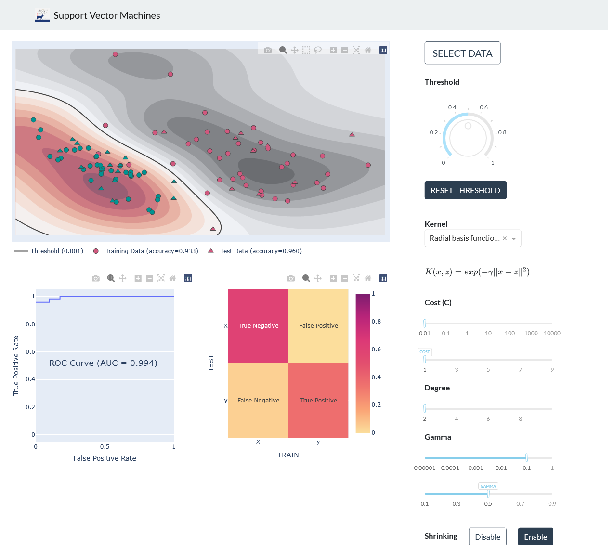

# About the app

This is a 2022 replica of [dash-svm](https://dash.gallery/dash-svm/). I used dash's recent new components and new features and had a great experience. 

  

You can see it [here](https://dash-svm-2022.herokuapp.com/). There's also a [gif](assets/demo.gif).  

It already contains the necessary profiles needed to deploy on Heroku and you can easily run it.

