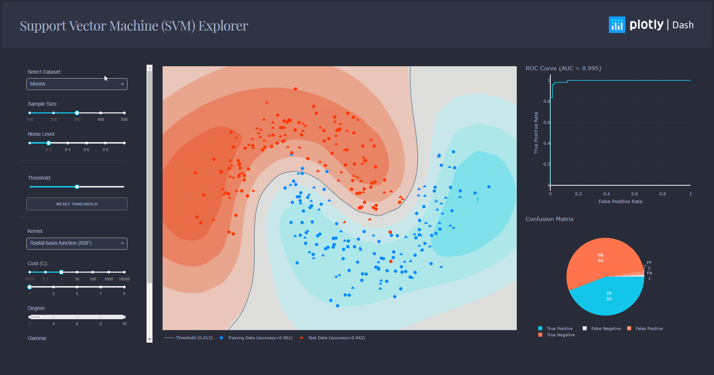

# Support Vector Machine (SVM) Explorer [](https://github.com/josephmisiti/awesome-machine-learning)

This is a learning tool and exploration app made using the Dash interactive Python framework developed by [Plotly](https://plot.ly/).

Dash abstracts away all of the technologies and protocols required to build an interactive web-based application and is a simple and effective way to bind a user interface around your Python code. To learn more check out our [documentation](https://plot.ly/dash).

Try out the [demo app here](https://dash-gallery.plotly.host/dash-svm/).




## Getting Started
### Using the demo
This demo lets you interactive explore Support Vector Machine (SVM). 

It includes a few artificially generated datasets that you can choose from the dropdown, and that you can modify by changing the sample size and the noise level of those datasets.

The other dropdowns and sliders lets you change the parameters of your classifier, such that it could increase or decrease its accuracy.

### Running the app locally

First create a virtual environment with conda or venv inside a temp folder, then activate it.

```
virtualenv dash-svm-venv

# Windows
dash-svm-venv\Scripts\activate
# Or Linux
source venv/bin/activate
```

Clone the git repo, then install the requirements with pip
```
git clone https://github.com/plotly/dash-sample-apps
cd dash-sample-apps/apps/dash-svm
pip install -r requirements.txt
```

Run the app
```
python app.py
```

## About the app
### How does it work?

This app is fully written in Dash + scikit-learn. All the components are used as input parameters for scikit-learn functions, which then generates a model with respect to the parameters you changed. The model is then used to perform predictions that are displayed on a contour plot, and its predictions are evaluated to create the ROC curve and confusion matrix.

In addition to creating models, scikit-learn is used to generate the datasets you see, as well as the data needed for the metrics plots.

### What is an SVM?
An SVM is a popular Machine Learning model used in many different fields. You can find an [excellent guide to how to use SVMs here](https://www.csie.ntu.edu.tw/~cjlin/papers/guide/guide.pdf).

## Built With
* [Dash](https://dash.plot.ly/) - Main server and interactive components
* [Plotly Python](https://plot.ly/python/) - Used to create the interactive plots
* [Scikit-Learn](http://scikit-learn.org/stable/documentation.html) - Run the classification algorithms and generate datasets


## Authors

* **Xing Han Lu** - *Initial Work* - [@xhlulu](https://github.com/xhlulu)
* **Matthew Chan** - *Code Review* - [@matthewchan15](https://github.com/matthewchan15)
* **Yunke Xiao** - *Redesign* - [@YunkeXiao](https://github.com/YunkeXiao)
* **celinehuang** - *Code Review* - [@celinehuang](https://github.com/celinehuang)


## Acknowledgments
The heatmap configuration is heavily inspired from the [scikit-learn Classification Comparison Tutorial](http://scikit-learn.org/stable/auto_examples/classification/plot_classifier_comparison.html). Please go take a look!

The idea of the [ROC Curve, the Matrix Pie Chart and Thresholding](https://github.com/nicolaskruchten/dash-roc) came from @nickruchten. The app would not have been as complete without his insightful advice.

