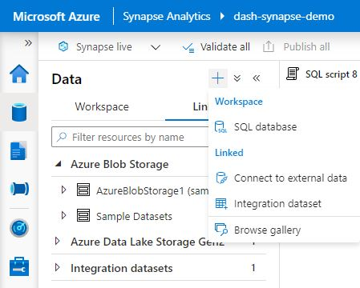
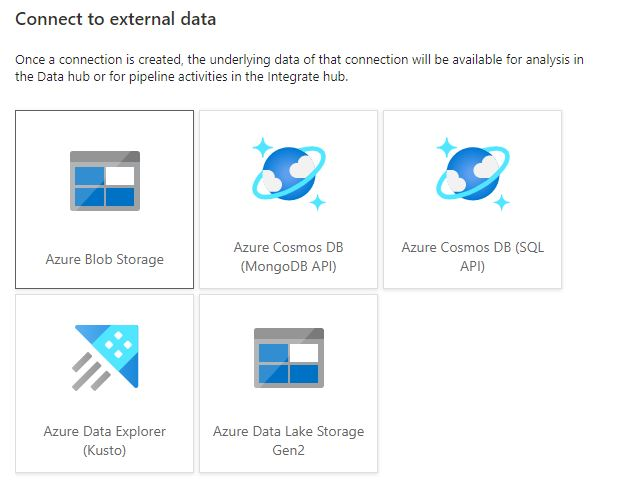
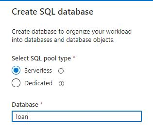

# Azure Synapse Analytics (Integration Demo)

This demo shows how to integrate Azure Synapse Analytics within a Dash app.

## Setting up Synapse

This app uses an Azure Synapse Analytics database for querying the data used to train the model.

### Datasets

The data used was retrieved and modified from the [Lending Club Loan Data](https://www.kaggle.com/wendykan/lending-club-loan-data) from Kaggle. By using this dataset, you are agreeing to Kaggle's terms of use, as well as the original data license. You can download the modified files here:
* `clean_loan.csv`: [Link](https://plotly-tutorials.s3-us-west-1.amazonaws.com/dash-sample-apps/snowflake-demos/clean_loan.csv)
* `loan_desc.csv`: [Link](https://plotly-tutorials.s3-us-west-1.amazonaws.com/dash-sample-apps/snowflake-demos/loan_desc.csv)

### Installion ODBC driver

[This tutorial](https://docs.microsoft.com/en-us/sql/connect/odbc/linux-mac/installing-the-microsoft-odbc-driver-for-sql-server?view=sql-server-ver15) shows how to install ODBC driver for SQL Server on Linux. You will need to install ODBC 17 to use this app - if you need another version, you will have to update the selected drivers by modifying the source code.

### SQL Setup from CSV file

Use the Azure Storage Explorer application to uploading `clean_loan.csv` to Azure Blob Storage. See [tutorial](https://docs.microsoft.com/en-us/azure/storage/blobs/storage-quickstart-blobs-storage-explorer).


The following steps require Synapse Studio.

<!-- Connect to your Azure Blob Storage by selecting Data > "+" > Connect to external data > "Azure Blog Storage".


 -->


Create a database called loan:



Inside the SQL Editor, select "loan" for "Use database".

Create a new data source linking to the Azure Blob Storage containing the CSV file you previously uploaded. Execute the following (change the location if needed):
```sql
USE [loan];
GO

CREATE EXTERNAL DATA SOURCE sampleapps
WITH ( LOCATION = 'https://sampleappsdata.blob.core.windows.net/');
```

Create a new format called "QuotedCsvWithHeaderFormat". Execute the following:

```sql
USE [loan];
GO

CREATE EXTERNAL FILE FORMAT CsvWithHeaderFormat
WITH (  
    FORMAT_TYPE = DELIMITEDTEXT,
    FORMAT_OPTIONS ( FIELD_TERMINATOR = ',', FIRST_ROW = 2   )
);
GO
```

Finally, you can create your table:
```sql
USE [loan];
GO

CREATE EXTERNAL TABLE cleanLoan
(
    loan_amnt INT,
    funded_amnt INT,
    revol_bal INT,
    policy_code INT,
    funded_amnt_inv FLOAT,
    int_rate FLOAT,
    installment FLOAT,
    annual_inc FLOAT,
    dti FLOAT,
    delinq_2yrs FLOAT,
    inq_last_6mths FLOAT,
    open_acc FLOAT,
    pub_rec FLOAT,
    revol_util FLOAT,
    total_acc FLOAT,
    out_prncp FLOAT,
    out_prncp_inv FLOAT,
    total_pymnt FLOAT,
    total_pymnt_inv FLOAT,
    term VARCHAR (100) COLLATE Latin1_General_BIN2,
    grade VARCHAR (100) COLLATE Latin1_General_BIN2,
    emp_length VARCHAR (100) COLLATE Latin1_General_BIN2,
    home_ownership VARCHAR (100) COLLATE Latin1_General_BIN2,
    verification_status VARCHAR (100) COLLATE Latin1_General_BIN2,
    loan_status VARCHAR (100) COLLATE Latin1_General_BIN2,
    pymnt_plan VARCHAR (100) COLLATE Latin1_General_BIN2,
    purpose VARCHAR (100) COLLATE Latin1_General_BIN2,
    initial_list_status VARCHAR (100) COLLATE Latin1_General_BIN2,
    application_type VARCHAR (100) COLLATE Latin1_General_BIN2
)
WITH (
    LOCATION = 'dash-sample-apps-data/clean_loan.csv',
    DATA_SOURCE = sampleapps,
    FILE_FORMAT = CsvWithHeaderFormat
);
```

The columns can be generated with the following code (run after you downloaded `clean_loan.csv`):
```python
import pandas as pd
import utils

df = pd.read_csv("clean_loan.csv", nrows=5)
print(utils.get_column_strings(df))
```


### Using a different user

If you do not want to use your admin account, you can create one for the `loan` database limited to `SELECT`ing:
```sql
CREATE LOGIN developers WITH PASSWORD = '<your-password>';

USE [loan]
GO;

CREATE USER developers FROM LOGIN developers;
GRANT SELECT TO developers;
```

Set the username to `developers` and the password to your new password.

Read more about [GRANT](https://docs.microsoft.com/en-us/azure/synapse-analytics/sql/sql-authentication?tabs=serverless) and [SQL authentication](https://docs.microsoft.com/en-us/azure/synapse-analytics/sql/sql-authentication?tabs=serverless).


## Setting up the app

First clone this repo:
```
git clone https://github.com/plotly/dash-sample-apps.git
cd dash-sample-apps/apps/dash-interest-rate
```

Create a conda env (or venv) and install the requirements:
```
conda create -n dash-interest-rate python=3.6.7
conda activate dash-interest-rate
pip install -r requirements.txt
```


## Start the app

Start a redis server:
```
redis-server --port 7777
```

In a separate terminal window, you can now run the app:
```
python app.py
```

and visit http://127.0.0.1:8050/.