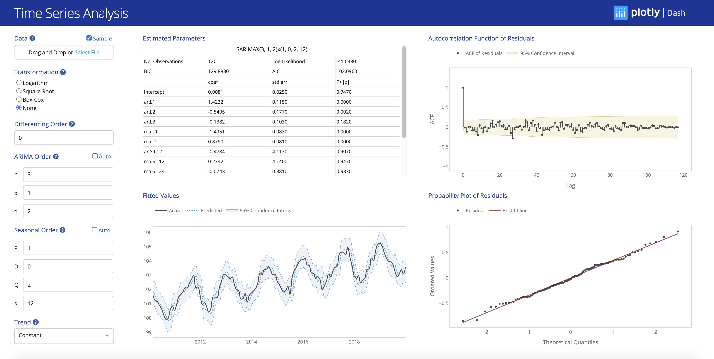

# Time Series Analysis

## About this app

This app fits a seasonal autoregressive integrated moving average (SARIMA) model to an user-provided time series.
The user can upload the data in CSV, TXT, XLS or XLSX format. The input file should contain the dates in the first 
column and the values in the second column, without column headers. Any missing values are automatically removed
by the app.

The app allows the user to apply a transformation to the data (logarithm, square root or 
[Box-Cox](https://docs.scipy.org/doc/scipy/reference/generated/scipy.stats.boxcox.html)) as well as to
difference the data prior to fitting the SARIMA model. The order of the SARIMA model can be either provided by 
the user or automatically determined, in which case the 
[`auto_arima`](https://alkaline-ml.com/pmdarima/modules/generated/pmdarima.arima.auto_arima.html) 
function in the `pmdarima` library is used to find the optimal order. The parameters of the SARIMA model are estimated 
using the [`SARIMAX`](https://www.statsmodels.org/dev/generated/statsmodels.tsa.statespace.sarimax.SARIMAX.html) 
function in the `statsmodels` library.

The app includes a table with the estimated model parameters, a plot of the fitted values against the actual values,
the autocorrelation function (ACF) of the model residuals and the probability plot of the model residuals. The table
containing the estimated model parameters is the standard `statsmodels` Maximum Likelihood Estimation (MLE) summary 
table. The model predictions (including the associated 95% confidence interval) and the model residuals are also 
provided by `statsmodels` as an output of the `SARIMAX` function. The ACF of the residuals (including the corresponding 
95% confidence interval) is calculated using the 
[`acf`](https://www.statsmodels.org/dev/generated/statsmodels.tsa.stattools.acf.html)
function in the `statsmodels` library, while the probability plot of the residuals is obtained using the 
[`probplot`](https://docs.scipy.org/doc/scipy/reference/generated/scipy.stats.probplot.html) 
function in the `scipy` library.

## How to run this app

To run this app, clone the repository and then open a terminal to the app folder.

```
git clone https://github.com/plotly/dash-sample-apps.git
cd dash-sample-apps/apps/dash-time-series/
```

1. Create and activate a new virtual environment (recommended) by running
the following:

    On Windows
    
    ```
    virtualenv venv 
    \venv\scripts\activate
    ```
    
    On Linux
    
    ```bash
    python3 -m venv myvenv
    source myvenv/bin/activate
    ```

2. Install the requirements:

    ```
    pip install -r requirements.txt
    ```

3. Run the app:

    ```
    python app.py
    ```

## Screenshot



## Resources
This app was built with Dash. For more details, see the Dash [documentation](https://plot.ly/dash).
