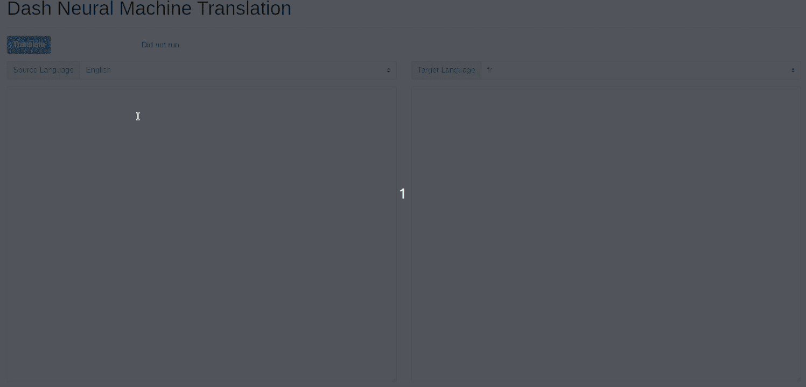

# Dash Neural Machine Translation (with MarianMT)
[](https://colab.research.google.com/github/plotly/dash-sample-apps/blob/master/apps/dash-translate/ColabDemo.ipynb)

This app written in less than 150 lines of Python lets you build a full fledge application for translating english text into romance languages, using [Huggingface's version of Marian](https://huggingface.co/transformers/model_doc/marian.html). This app can be easily modified to incorporate other languages, other models, and even other frameworks (such as [fairseq](https://github.com/pytorch/fairseq)).



## Instructions

To get started, first clone this repo:
```
git clone https://github.com/plotly/dash-translate-apps.git
cd dash-sample-apps/apps/dash-translate
```

Create a conda env (or venv) and install the requirements:
```
conda create -n dash-translate python=3.7.6
conda activate dash-translate
pip install -r requirements.txt
```

You can now run the app:
```
python app.py
```

and visit http://127.0.0.1:8050/.