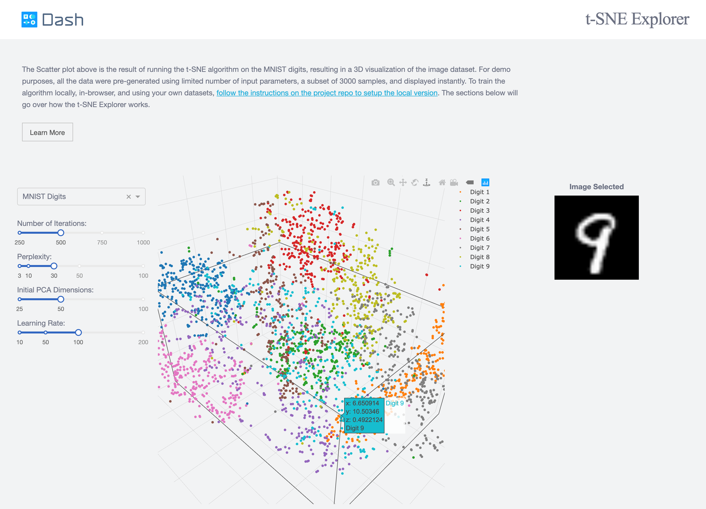
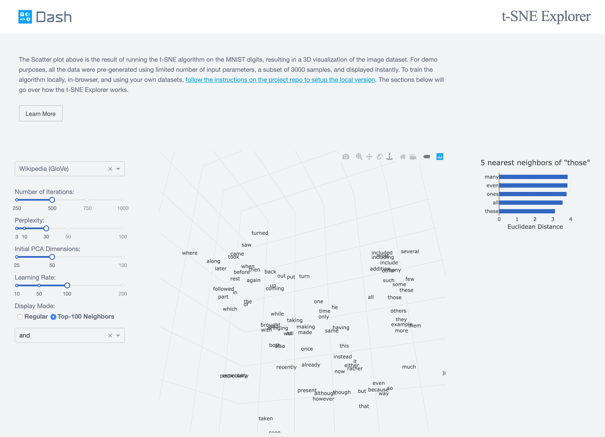
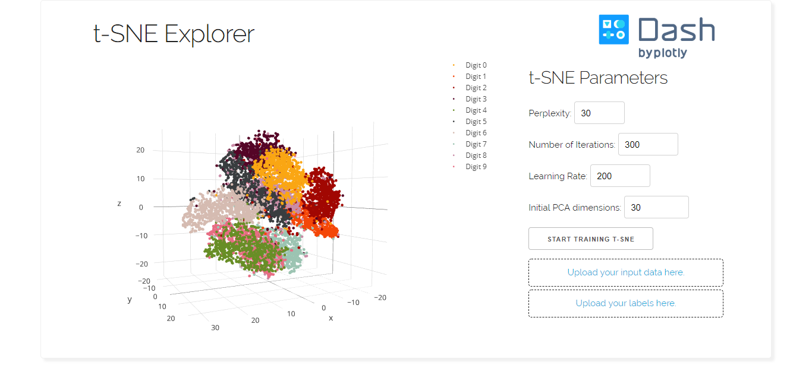
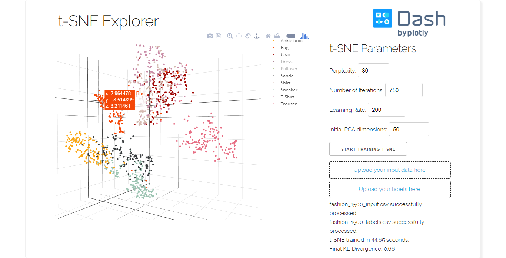

# t-SNE Explorer

This is a new updated demo of the Dash interactive Python framework developed by [Plotly](https://plot.ly/).

Dash abstracts away all of the technologies and protocols required to build an interactive web-based application and is a simple and effective way to bind a user interface around your Python code. To learn more check out our [documentation](https://plot.ly/dash).

## Getting Started

### Using the demo

To get started, choose a dataset you want to visualize. When the scatter plot appears on the graph, you can see the original image by clicking on a data point.

Alternatively, you can explore the GloVe Word Vectors datasets, which are encoded vectors of large collection of texts from Wikipedia, Twitter, and acquired through Web Crawlers. Upon clicking a data point, you will be able to see the 5 closest neighbors of the word you clicked.

### Running the app locally

First create a virtual environment with conda or venv inside a temp folder, then activate it.

```
virtualenv dash-tsne-venv

# Windows
dash-tsne-venv\Scripts\activate
# Or Linux
source venv/bin/activate
```

Clone the git repo, then install the requirements with pip

```
git clone https://github.com/plotly/dash-tsne.git
cd dash-tsne
pip install -r requirements.txt
```

Run the app

```
python app.py
```

### How to use the local version

To train your own t-SNE algorithm, input a high-dimensional dataset with only numerical values, and the corresponding labels inside the upload fields. For convenience, small sample datasets are included inside the data directory. [You can also download them here](https://www.dropbox.com/sh/l79mcmlqil7w7so/AACfQhp7lUS90sZUedsqAzWOa?dl=0&lst=). The training can take a lot of time depending on the size of the dataset (the complete MNIST dataset could take 15-30 min), and it is not advised to refresh the webpage when you are doing so.

### Generating data

`generate_data.py` is included to download, flatten and normalize datasets, so that they can be directly used in this app. It uses keras.datasets, which means that you need install keras. To use the script, simply go to the path containing it and run in terminal:

`python generate_data.py [dataset_name] [sample_size]`

which will create the csv file with the corresponding parameters. At the moment, we have the following datasets:

- MNIST
- CIFAR10
- Fashion_MNIST

## About the app

### What is t-SNE?

t-distributed stochastic neighbor embedding, created by van der Maaten and Hinton in 2008, is a visualization algorithm that reduce a high-dimensional space (e.g. an image or a word embedding) into two or three dimensions, facilitating visualization of the data distribution.

A classical example is MNIST, a dataset of 60,000 handwritten digits, 28x28 grayscale. Upon reducing the set of images using t-SNE, you can see all the digit clustered together, with few outliers caused by poor calligraphy. [You can read a detailed explanation of the algorithm on van der Maaten's personal blog.](https://lvdmaaten.github.io/tsne/)

## Built With

- [Dash](https://dash.plot.ly/) - Main server and interactive components
- [Plotly Python](https://plot.ly/python/) - Used to create the interactive plots
- [Scikit-Learn](http://scikit-learn.org/stable/documentation.html) - Run the t-SNE algorithm

## Contributing

Please read [CONTRIBUTING.md](CONTRIBUTING.md) for details on our code of conduct, and the process for submitting pull requests to us.

## Authors

- **Celine Huang** [@celinehuang](https://github.com/celinehuang)
- **Xing Han Lu** - _Initial Work_ - [@xhlulu](https://github.com/xhlulu)

See also the list of [contributors](https://github.com/plotly/dash-svm/contributors) who participated in this project.

## License

This project is licensed under the MIT License - see the [LICENSE.md](LICENSE.md) file for details

## Acknowledgments

## Screenshots

The following are screenshots for the demo app:





The following are screenshots for the full (local) app:



