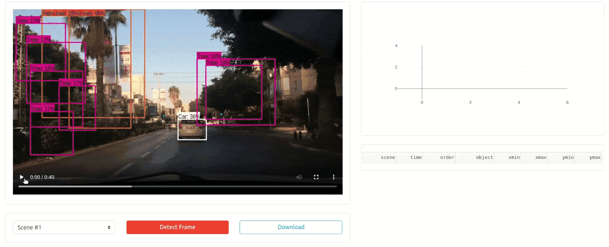

<!--
To get started, replace
Dash Editable Video Detection with your app name (e.g. Dash Super Cool App)
dash-av-video-detection with the short handle (e.g. dash-super-cool)

If this is in dash sample apps, uncomment the second "git clone https..." and remove the first one.
If this is in dash sample apps and you have a colab demo, uncomment the "Open in Colab" link to see the badge (make sure to create a ColabDemo.ipynb) first.

-->
# Dash Editable Video Detection
<!-- 
[](https://colab.research.google.com/github/plotly/dash-sample-apps/blob/master/apps/dash-av-video-detection/ColabDemo.ipynb)
 -->

Given a pre-annotated video, this lets you run 2D object detection on a selected frame. You can also edit the annotations, add new bounding boxes, and export the new data table. Get the source code and read the blog post.

💻 [Demo](https://dash-gallery.plotly.host/dash-video-detection/)

📰 [Article](https://medium.com/plotly/the-history-of-autonomous-vehicle-datasets-and-3-open-source-python-apps-for-visualizing-them-afee9d13f58a)



## Instructions

To get started, first clone this repo:


```
git clone https://github.com/plotly/dash-sample-apps.git
cd dash-sample-apps/apps/dash-video-detection
```


Create and activate a conda env:
```
conda create -n dash-video-detection python=3.7.6
conda activate dash-video-detection
```

Or a venv (make sure your `python3` is 3.6+):
```
python3 -m venv venv
source venv/bin/activate  # for Windows, use venv\Scripts\activate.bat
```

Install all the requirements:

```
pip install -r requirements.txt
```

You can now run the app:
```
python app.py
```

and visit http://127.0.0.1:8050/.


## Run object detection on videos

## Compress Video

Run:

```
ffmpeg -i input.mov -vcodec libx264 -crf 28 output.mov
```

Replace `input.mov` with the processed video, and `output.mov` to be the compressed video. For example:

```
ffmpeg -i ./data/processed/scene_1.mov -vcodec libx264 -crf 28 ./static/scene_1.mov
ffmpeg -i ./data/processed/scene_2.mov -vcodec libx264 -crf 28 ./static/scene_2.mov
ffmpeg -i ./data/processed/scene_3.mov -vcodec libx264 -crf 28 ./static/scene_3.mov
rm ./data/processed/scene*.mov
```

## Contact

Interested in building or deploying apps like this? [Reach out](https://plotly.com/contact-us/) or [get a demo](https://plotly.com/get-demo).