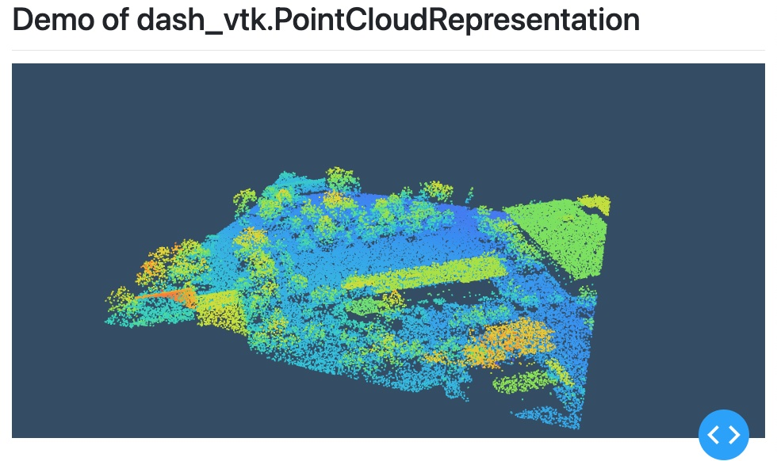

# Demo of `dash_vtk.PointCloudRepresentation`



## Instructions

See instructions from [README.md](../../README.md) to create a virtual environment and install the dependencies.

## Goal

The goal of that example is to show you how you can use PyVista
to get a PointCloud and render it using dash-vtk on the client side.

For that specific example we rely on `PointCloudRepresentation` to render a point cloud via a simplified element
that encapsulate the following structure.

```
<GeometryRepresentation
  id={props.id}
  colorMapPreset={props.colorMapPreset}
  colorDataRange={props.colorDataRange}
  property={props.property}
>
  <PolyData points={props.xyz} connectivity='points'>
    {nbComponents && (
      <PointData>
        <DataArray
          registration='setScalars'
          numberOfComponents={nbComponents}
          values={values}
          type={type}
        />
      </PointData>
    )}
  </PolyData>
</GeometryRepresentation>
```
