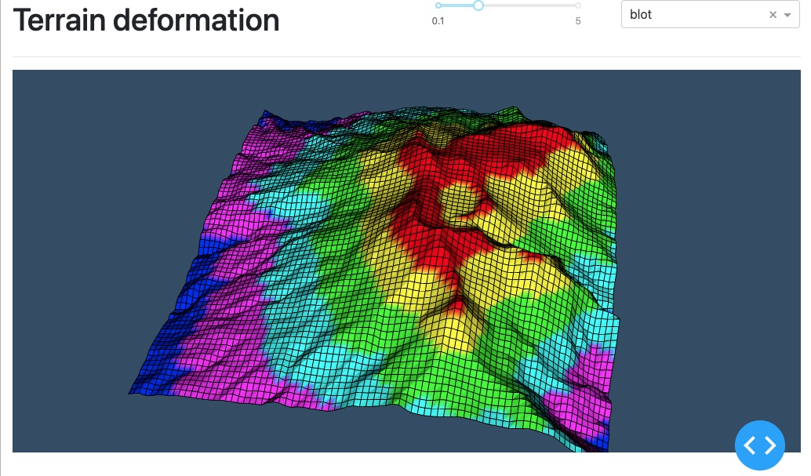

# Demo of Terrain deformation using PyVista and dash-vtk

## Instructions

See instructions from [README.md](../../README.md) to create a virtual environment and install the dependencies.

## Goal

The goal of that example is to show you how you can use PyVista
to get a mesh and transform it using dash-vtk for its rendering.
