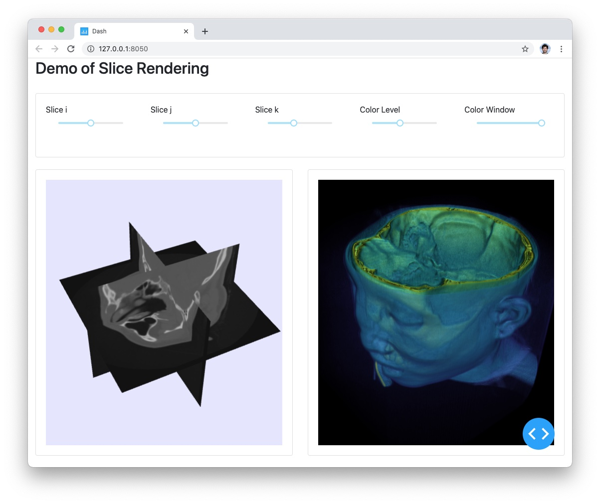

# Demo of multi-view rendering of Volume and slices

## Instructions

See instructions from [README.md](../../README.md) to create a virtual environment and install the dependencies.

## Goal

This example aims to show how to load a vtkImageData using VTK and push it to the dash-vtk components for rendering.
In that example we create 1 vtkImageData that get shared on the client side across 2 views where one is doing volume rendering and the other is doing 3 slices of that same volume.
