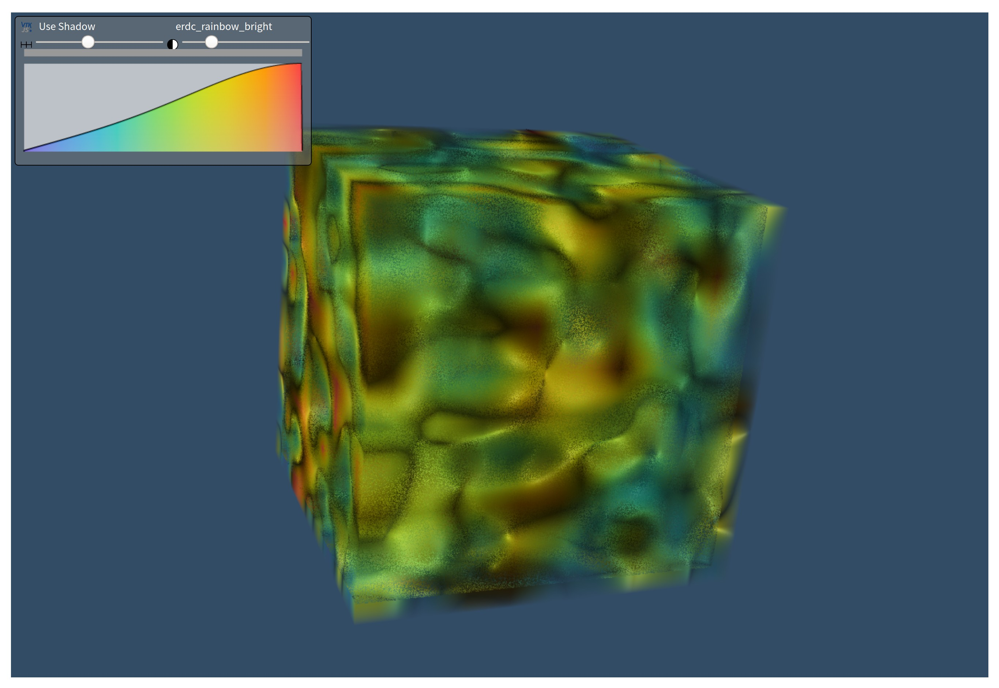

# Demo of volume rendering

## Instructions

See instructions from [README.md](../../README.md) to create a virtual environment and install the dependencies.

## Goal

This example aims to show how do volume rendering of a synthetic image data by only providing the grid information and values.
