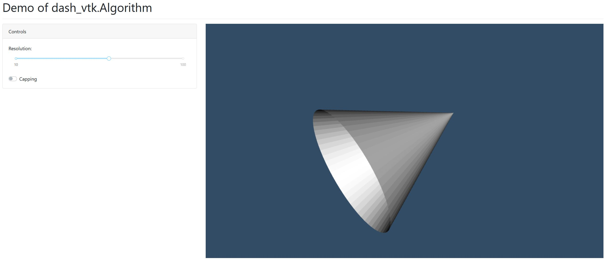

# Demo of `dash_vtk.Algorithm`

## Instructions

See instructions from [README.md](../../README.md) to create a virtual environment and install the dependencies.

## Goal

This example aims to show how to use the <Algoritm> element to instanciate and control a vtk source.
