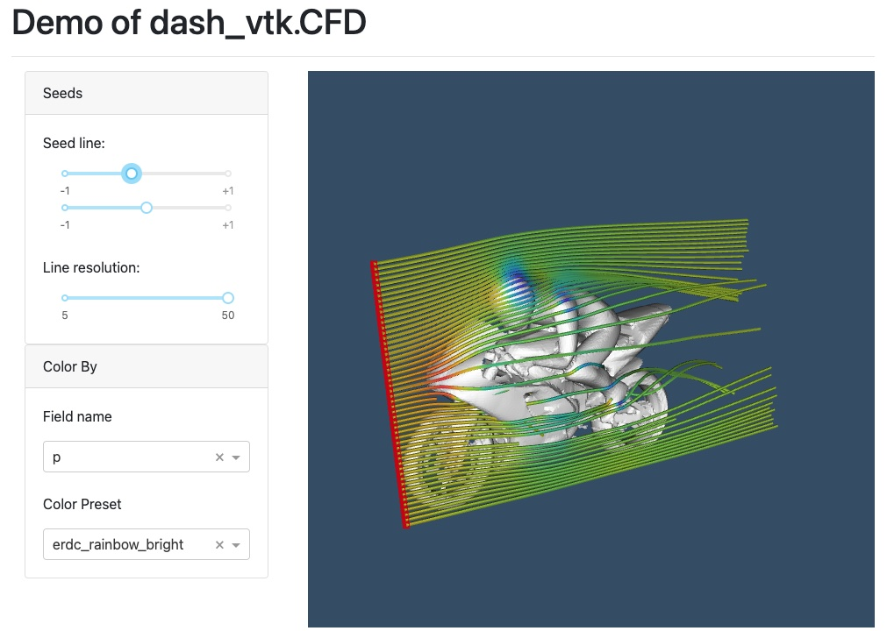

# Demo of VTK for data processing and dash-vtk for rendering

## Instructions

See instructions from [README.md](../../README.md) to create a virtual environment and install the dependencies.

## Goal

The goal of that example is to show you how you can use PyVista/VTK to load and process some CFD dataset and dynamically adjust some filter parameters and render the result in a 3D Web view using dash-vtk.
