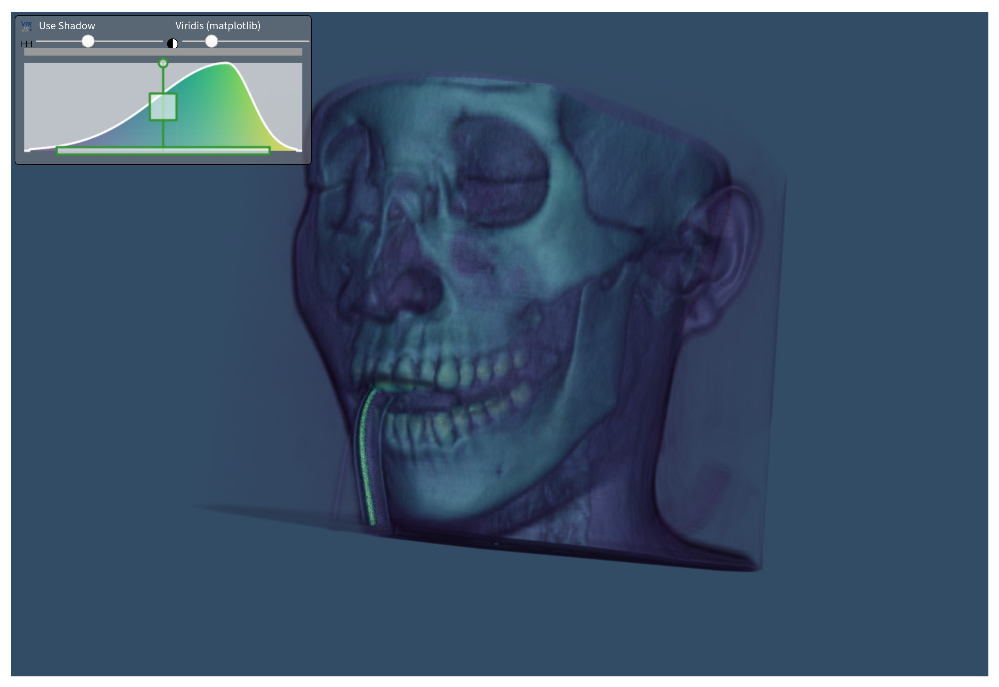

# Demo of volume rendering

## Instructions

See instructions from [README.md](../../README.md) to create a virtual environment and install the dependencies.

## Goal

This example aims to show how to load a vtkImageData using VTK and push it to the dash-vtk components for doing Volume rendering.
