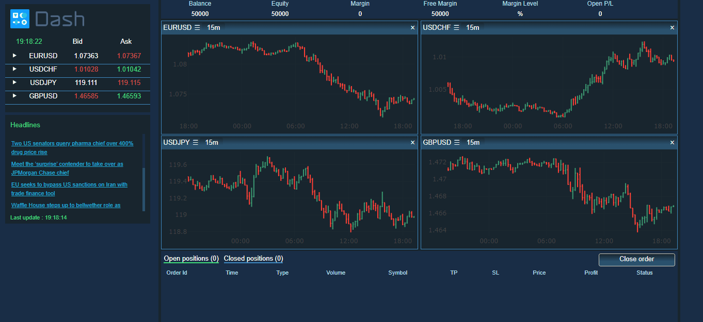

# dash-web-trader
This is a demo of the Dash interactive Python framework developed by [Plotly](https://plot.ly/).

Dash abstracts away all of the technologies and protocols required to build an interactive web-based application and is a simple and effective way to bind a user interface around your Python code. To learn more check out our [documentation](https://plot.ly/dash).

Try out the [demo app here](https://dash-gallery.plotly.host/dash-web-trader).



## Getting Started

### Using the demo
This demo lets you explore historical forex major pairs ticks data from Pepperstone. 

The left panel displays ask and bid prices for each pair by reading the dataset on interval updates. If you click on the row, you see that you can also add charts or buy/sell pairs.

You can also visualize market prices with candlesticks, line, OHLC bars and make some studies on it with the selected period in the dropdown.
You can choose these options in the graph div menu by clicking on ☰ .

Finally, top news articles from BBC are displayed on the left and updated on interval updates, using https://newsapi.org/ 

### Running the app locally

First create a virtual environment with conda or venv inside a temp folder, then activate it.

```
virtualenv dash-web-trader-venv

# Windows
dash-web-trader-venv\Scripts\activate
# Or Linux
source venv/bin/activate
```

Clone the git repo, then install the requirements with pip
```
git clone https://github.com/amadoukane96/dash-web-trader.git
cd dash-web-trader
pip install -r requirements.txt
```

Run the app
```
python app.py
```
