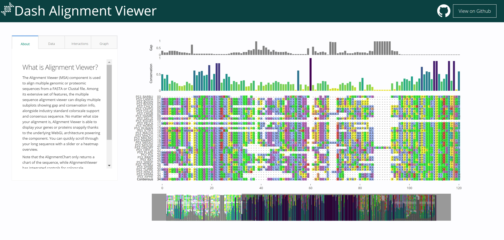

# DashR Alignment Viewer 

## About this App:

The Alignment Viewer (MSA) component is used to align multiple genomic or proteomic sequences from a FASTA or Clustal file. This interactive app allows you to display multiple subplots showing gap and conservation info, alongside industry standard colorscale support and consensus sequence. More information about the component is available [here](https://github.com/plotly/react-alignment-viewer).

## How to Run the App

Clone the repository:

```
git clone https://github.com/plotly/dash-sample-apps
cd dash-sample-apps/apps/dashr-alignment-viewer
```

Run `app.R`

The app will load into your default browser window. If it does not, navigate to 127.0.0.1:8050.

## Screenshots



## More

Learn more about Plotly and Dash [here](https://plot.ly/dash).
